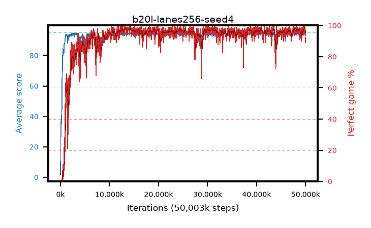

# b20l-lanes256-seed4

step **50,003,968** · 1526 evals · trailing **94.14** · peak **94.43** @48,431,104 · sef **93.4** · best30 **97.6** @13,303,808

## Config

| | |
|---|---|
| algo | ppo |
| collect_envs | 256 |
| discount | 0.99 |
| eval_interval | 32768 |
| eval_queue | True |
| eval_queue_depth | 16 |
| eval_workers | 8 |
| fc_layers | (320,) |
| graph_eval_episodes | 100 |
| max_steps | 50003968 |
| min_checkpoint_score | 40.0 |
| ppo_adam_epsilon | 1e-07 |
| ppo_anneal_fraction | 1.0 |
| ppo_clip | 0.2 |
| ppo_clip_final | None |
| ppo_entropy_coef | 0.01 |
| ppo_entropy_coef_final | None |
| ppo_epochs | 4 |
| ppo_gae_lambda | 0.98 |
| ppo_gradient_clipping | 0.5 |
| ppo_horizon | 33.6 |
| ppo_learning_rate | 0.0003 |
| ppo_learning_rate_final | None |
| ppo_minibatch | 256 |
| ppo_normalize_adv | True |
| ppo_rollout | 128 |
| ppo_target_kl | 0.0 |
| ppo_transitions_per_rollout | 32768 |
| ppo_value_loss | huber |
| ppo_vf_coef | 0.5 |
| seed | 4 |
| torch_threads | 1 |

## Evals

| step | avg score | trailing avg | min score | max score | avg reward | perfect % | epsilon |
|---|---|---|---|---|---|---|---|
| 32768 | 1.96 | 1.96 | 0.0 | 7.0 | -1.023 | 0.0 |  |
| 65536 | 31.08 | 27.24 | 2.0 | 65.0 | 26.057 | 0.0 |  |
| 98304 | 30.55 | 16.25 | 11.0 | 59.0 | 25.497 | 0.0 |  |
| ... | ... | ... | ... | ... | ... | ... | ... |
| 49643520 | 94.0 | 94.09 | 30.0 | 95.0 | 190.731 | 98.0 |  |
| 49676288 | 94.63 | 94.1 | 64.0 | 95.0 | 191.347 | 98.0 |  |
| 49709056 | 94.99 | 94.1 | 94.0 | 95.0 | 192.661 | 99.0 |  |
| 49741824 | 95.0 | 94.12 | 95.0 | 95.0 | 193.724 | 100.0 |  |
| 49774592 | 94.02 | 94.12 | 36.0 | 95.0 | 188.703 | 96.0 |  |
| 49807360 | 94.82 | 94.13 | 77.0 | 95.0 | 192.499 | 99.0 |  |
| 49840128 | 94.72 | 94.2 | 67.0 | 95.0 | 192.413 | 99.0 |  |
| 49872896 | 93.36 | 94.18 | 22.0 | 95.0 | 186.046 | 94.0 |  |
| 49905664 | 94.82 | 94.16 | 87.0 | 95.0 | 190.543 | 97.0 |  |
| 49938432 | 93.47 | 94.17 | 65.0 | 95.0 | 181.201 | 89.0 |  |
| 49971200 | 94.02 | 94.16 | 79.0 | 95.0 | 182.707 | 90.0 |  |
| 50003968 | 93.93 | 94.14 | 70.0 | 95.0 | 183.604 | 91.0 |  |
