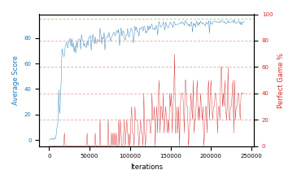

# b20m-fc320seed1

Blue is average score (food eaten) on the left axis, red is perfect-game percentage on the right.

Latest eval: step 241000, avg score 93.1, perfect games 40%.

## Config

| setting | value |
|---|---|
| policy_name | b20m-fc320seed1 |
| seed | 1 |
| zeroed_observations | none |
| learning_rate | 1e-05 |
| batch_size | 128 |
| discount | 0.9975 |
| target_update_period | 1000 |
| target_update_tau | 1.0 |
| gradient_clipping | none |
| n_step_update | 1 |
| initial_epsilon | 0.4 |
| min_epsilon | 0.002 |
| epsilon_schedule | bootstrap on avg_reward [2, 5, 10, 15, 20] then geometric to floor by 80% trailing-30 perfect |
| guided_fraction | 0.8 |
| forking | up to 4 live branches including the main line, fork p=0.5 at length >= 85, branch capped at 60 steps, one branch advanced per iteration |
| exploration_shield | 80% of refinement-phase episodes draw the epsilon move from non-fatal actions; greedy moves never shielded |
| fc_layer_params | (320,) |
| replay_buffer | cpprb prioritized, capacity 100000 |
| priority_exponent (alpha) | 0.6 |
| priority_signal | td_error |
| importance_sampling_beta | 0.4 -> 1.0 over 300000 steps |
| max_steps | 3000000 |
| initial_populate_steps | 1000 |
| eval | 10 episodes every 1000 steps |
| grid | 9x9, max possible score 95 |
| DEATH_REWARD | -5.0 |
| FOOD_REWARD | 1.0 |
| FOOD_DISTANCE_REWARD | 0.0 |
| eval_only | False |
| min_checkpoint_score | 40.0 |

## Evals

242 evals so far. Full series in [`b20m-fc320seed1_evals.json`](b20m-fc320seed1_evals.json).

| step | avg score | trailing avg | min score | max score | avg reward | perfect % | epsilon |
|---|---|---|---|---|---|---|---|
| 0 | 0.0 | 0.0 | 0 | 0/95 | -5.0 | 0 | 0.4 |
| 1000 | 0.7 | 0.7 | 0 | 2/95 | 0.2 | 0 | 0.4 |
| 2000 | 0.9 | 0.8 | 0 | 4/95 | 0.4 | 0 | 0.4 |
| ... | | | | | | | |
| 230000 | 91.7 | 92.78 | 84 | 95/95 | 111.1 | 20 | 0.0059 |
| 231000 | 91.5 | 92.5 | 80 | 95/95 | 120.85 | 30 | 0.0059 |
| 232000 | 91.8 | 92.1 | 88 | 95/95 | 121.15 | 30 | 0.0058 |
| 233000 | 92.1 | 92.18 | 86 | 95/95 | 131.4 | 40 | 0.0058 |
| 234000 | 93.4 | 92.1 | 92 | 95/95 | 132.7 | 40 | 0.0057 |
| 235000 | 92.9 | 92.34 | 90 | 95/95 | 122.25 | 30 | 0.0058 |
| 236000 | 90.4 | 92.12 | 70 | 95/95 | 109.35 | 20 | 0.0059 |
| 237000 | 92.7 | 92.3 | 90 | 95/95 | 132.0 | 40 | 0.0058 |
| 238000 | 90.1 | 91.9 | 74 | 95/95 | 129.4 | 40 | 0.0057 |
| 239000 | 92.3 | 91.68 | 86 | 95/95 | 131.6 | 40 | 0.0056 |
| 240000 | 91.9 | 91.48 | 84 | 95/95 | 131.2 | 40 | 0.0056 |
| 241000 | 93.1 | 92.02 | 90 | 95/95 | 131.95 | 40 | 0.0055 |
