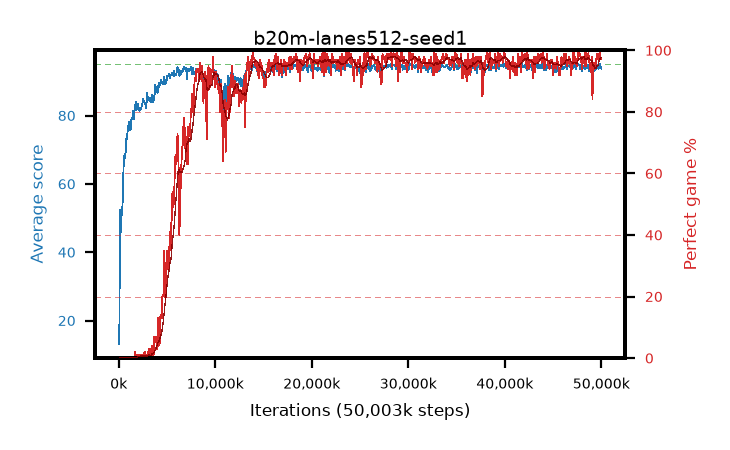

# b20m-lanes512-seed1

step **50,003,968** · 763 evals · trailing **94.05** · peak **94.44** @29,360,128 · sef **84.3** · best30 **97.4** @29,360,128

## Config

| | |
|---|---|
| algo | ppo |
| collect_envs | 512 |
| discount | 0.99 |
| eval_interval | 65536 |
| eval_queue | True |
| eval_queue_depth | 16 |
| eval_workers | 8 |
| fc_layers | (320,) |
| graph_eval_episodes | 100 |
| max_steps | 50003968 |
| min_checkpoint_score | 40.0 |
| ppo_adam_epsilon | 1e-07 |
| ppo_anneal_fraction | 1.0 |
| ppo_clip | 0.2 |
| ppo_clip_final | None |
| ppo_entropy_coef | 0.01 |
| ppo_entropy_coef_final | None |
| ppo_epochs | 4 |
| ppo_gae_lambda | 0.98 |
| ppo_gradient_clipping | 0.5 |
| ppo_horizon | 33.6 |
| ppo_learning_rate | 0.0003 |
| ppo_learning_rate_final | None |
| ppo_minibatch | 256 |
| ppo_normalize_adv | True |
| ppo_rollout | 128 |
| ppo_target_kl | 0.0 |
| ppo_transitions_per_rollout | 65536 |
| ppo_value_loss | huber |
| ppo_vf_coef | 0.5 |
| seed | 1 |
| torch_threads | 1 |

## Evals

| step | avg score | trailing avg | min score | max score | avg reward | perfect % | epsilon |
|---|---|---|---|---|---|---|---|
| 65536 | 13.11 | 13.11 | 1.0 | 27.0 | 12.011 | 0.0 |  |
| 131072 | 52.3 | 39.86 | 12.0 | 79.0 | 47.872 | 0.0 |  |
| 196608 | 45.9 | 29.5 | 9.0 | 84.0 | 40.871 | 0.0 |  |
| ... | ... | ... | ... | ... | ... | ... | ... |
| 49283072 | 93.09 | 94.1 | 16.0 | 95.0 | 185.82 | 94.0 |  |
| 49348608 | 93.55 | 94.08 | 6.0 | 95.0 | 188.249 | 96.0 |  |
| 49414144 | 93.5 | 94.05 | 16.0 | 95.0 | 187.184 | 95.0 |  |
| 49479680 | 94.57 | 94.05 | 61.0 | 95.0 | 190.231 | 97.0 |  |
| 49545216 | 94.93 | 94.02 | 88.0 | 95.0 | 192.638 | 99.0 |  |
| 49610752 | 93.98 | 94.02 | 10.0 | 95.0 | 189.681 | 97.0 |  |
| 49676288 | 94.33 | 93.99 | 28.0 | 95.0 | 192.046 | 99.0 |  |
| 49741824 | 93.75 | 93.98 | 8.0 | 95.0 | 189.468 | 97.0 |  |
| 49807360 | 94.78 | 94.0 | 73.0 | 95.0 | 192.494 | 99.0 |  |
| 49872896 | 95.0 | 94.07 | 95.0 | 95.0 | 193.706 | 100.0 |  |
| 49938432 | 94.08 | 94.0 | 14.0 | 95.0 | 189.803 | 97.0 |  |
| 50003968 | 93.76 | 94.05 | 26.0 | 95.0 | 189.486 | 97.0 |  |
