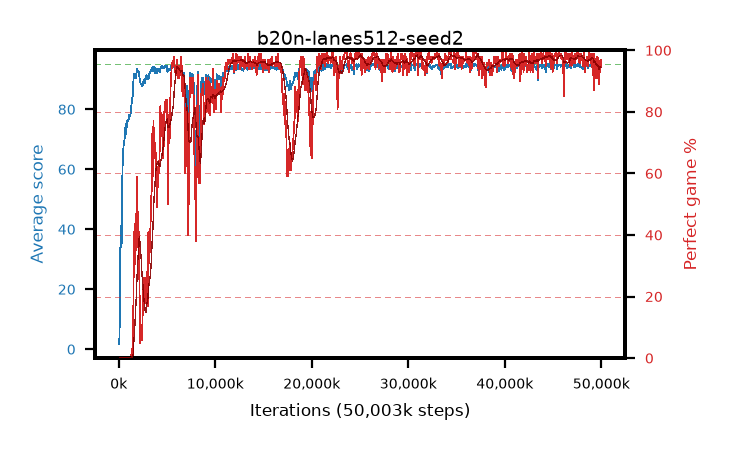

# b20n-lanes512-seed2

step **50,003,968** · 763 evals · trailing **94.24** · peak **94.51** @47,120,384 · sef **84.8** · best30 **97.8** @45,809,664

## Config

| | |
|---|---|
| algo | ppo |
| collect_envs | 512 |
| discount | 0.99 |
| eval_interval | 65536 |
| eval_queue | True |
| eval_queue_depth | 16 |
| eval_workers | 8 |
| fc_layers | (320,) |
| graph_eval_episodes | 100 |
| max_steps | 50003968 |
| min_checkpoint_score | 40.0 |
| ppo_adam_epsilon | 1e-07 |
| ppo_anneal_fraction | 1.0 |
| ppo_clip | 0.2 |
| ppo_clip_final | None |
| ppo_entropy_coef | 0.01 |
| ppo_entropy_coef_final | None |
| ppo_epochs | 4 |
| ppo_gae_lambda | 0.98 |
| ppo_gradient_clipping | 0.5 |
| ppo_horizon | 33.6 |
| ppo_learning_rate | 0.0003 |
| ppo_learning_rate_final | None |
| ppo_minibatch | 256 |
| ppo_normalize_adv | True |
| ppo_rollout | 128 |
| ppo_target_kl | 0.0 |
| ppo_transitions_per_rollout | 65536 |
| ppo_value_loss | huber |
| ppo_vf_coef | 0.5 |
| seed | 2 |
| torch_threads | 1 |

## Evals

| step | avg score | trailing avg | min score | max score | avg reward | perfect % | epsilon |
|---|---|---|---|---|---|---|---|
| 65536 | 1.7 | 1.7 | 0.0 | 5.0 | -0.949 | 0.0 |  |
| 131072 | 14.84 | 8.27 | 3.0 | 30.0 | 9.833 | 0.0 |  |
| 196608 | 41.04 | 22.93 | 13.0 | 85.0 | 35.923 | 0.0 |  |
| ... | ... | ... | ... | ... | ... | ... | ... |
| 49283072 | 94.67 | 94.32 | 62.0 | 95.0 | 192.387 | 99.0 |  |
| 49348608 | 93.58 | 94.3 | 65.0 | 95.0 | 186.289 | 94.0 |  |
| 49414144 | 94.61 | 94.19 | 67.0 | 95.0 | 190.327 | 97.0 |  |
| 49479680 | 93.38 | 94.33 | 20.0 | 95.0 | 183.104 | 91.0 |  |
| 49545216 | 94.75 | 94.27 | 77.0 | 95.0 | 191.457 | 98.0 |  |
| 49610752 | 94.35 | 94.28 | 48.0 | 95.0 | 191.032 | 98.0 |  |
| 49676288 | 93.71 | 94.2 | 64.0 | 95.0 | 184.436 | 92.0 |  |
| 49741824 | 93.11 | 94.21 | 26.0 | 95.0 | 180.86 | 89.0 |  |
| 49807360 | 93.56 | 94.18 | 61.0 | 95.0 | 184.286 | 92.0 |  |
| 49872896 | 94.63 | 94.2 | 78.0 | 95.0 | 189.349 | 96.0 |  |
| 49938432 | 94.52 | 94.21 | 64.0 | 95.0 | 190.251 | 97.0 |  |
| 50003968 | 94.45 | 94.24 | 73.0 | 95.0 | 188.18 | 95.0 |  |
