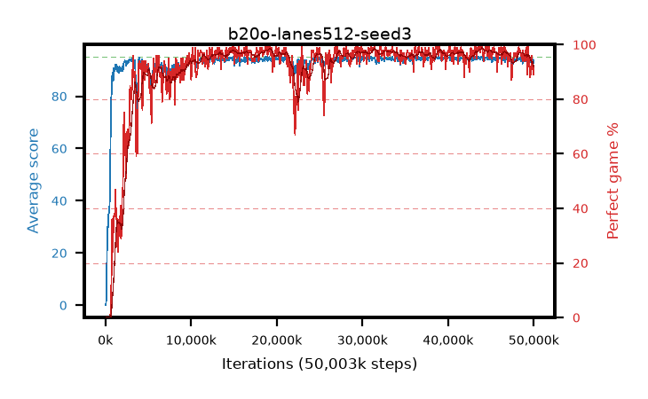

# b20o-lanes512-seed3

step **50,003,968** · 763 evals · trailing **93.9** · peak **94.53** @45,481,984 · sef **92.0** · best30 **98.0** @44,761,088

## Config

| | |
|---|---|
| algo | ppo |
| collect_envs | 512 |
| discount | 0.99 |
| eval_interval | 65536 |
| eval_queue | True |
| eval_queue_depth | 16 |
| eval_workers | 8 |
| fc_layers | (320,) |
| graph_eval_episodes | 100 |
| max_steps | 50003968 |
| min_checkpoint_score | 40.0 |
| ppo_adam_epsilon | 1e-07 |
| ppo_anneal_fraction | 1.0 |
| ppo_clip | 0.2 |
| ppo_clip_final | None |
| ppo_entropy_coef | 0.01 |
| ppo_entropy_coef_final | None |
| ppo_epochs | 4 |
| ppo_gae_lambda | 0.98 |
| ppo_gradient_clipping | 0.5 |
| ppo_horizon | 33.6 |
| ppo_learning_rate | 0.0003 |
| ppo_learning_rate_final | None |
| ppo_minibatch | 256 |
| ppo_normalize_adv | True |
| ppo_rollout | 128 |
| ppo_target_kl | 0.0 |
| ppo_transitions_per_rollout | 65536 |
| ppo_value_loss | huber |
| ppo_vf_coef | 0.5 |
| seed | 3 |
| torch_threads | 1 |

## Evals

| step | avg score | trailing avg | min score | max score | avg reward | perfect % | epsilon |
|---|---|---|---|---|---|---|---|
| 65536 | 0.04 | 0.04 | 0.0 | 1.0 | -4.268 | 0.0 |  |
| 131072 | 3.84 | 1.94 | 0.0 | 9.0 | 1.76 | 0.0 |  |
| 196608 | 21.02 | 8.3 | 4.0 | 41.0 | 16.233 | 0.0 |  |
| ... | ... | ... | ... | ... | ... | ... | ... |
| 49283072 | 95.0 | 93.61 | 95.0 | 95.0 | 193.704 | 100.0 |  |
| 49348608 | 94.85 | 93.62 | 87.0 | 95.0 | 191.568 | 98.0 |  |
| 49414144 | 94.2 | 93.87 | 63.0 | 95.0 | 184.911 | 92.0 |  |
| 49479680 | 94.51 | 93.95 | 69.0 | 95.0 | 189.226 | 96.0 |  |
| 49545216 | 93.1 | 93.8 | 67.0 | 95.0 | 179.835 | 88.0 |  |
| 49610752 | 93.75 | 93.91 | 78.0 | 95.0 | 182.48 | 90.0 |  |
| 49676288 | 93.02 | 93.91 | 20.0 | 95.0 | 180.759 | 89.0 |  |
| 49741824 | 94.64 | 93.97 | 81.0 | 95.0 | 189.366 | 96.0 |  |
| 49807360 | 93.35 | 93.97 | 8.0 | 95.0 | 186.07 | 94.0 |  |
| 49872896 | 93.96 | 93.98 | 60.0 | 95.0 | 185.699 | 93.0 |  |
| 49938432 | 92.64 | 93.9 | 20.0 | 95.0 | 180.336 | 89.0 |  |
| 50003968 | 93.72 | 93.9 | 67.0 | 95.0 | 184.44 | 92.0 |  |
