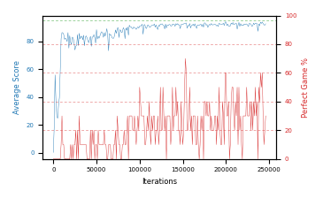

# b20p-fc320seed4

Blue is average score (food eaten) on the left axis, red is perfect-game percentage on the right.

Latest eval: step 246000, avg score 92.7, perfect games 30%.

## Config

| setting | value |
|---|---|
| policy_name | b20p-fc320seed4 |
| seed | 4 |
| zeroed_observations | none |
| learning_rate | 1e-05 |
| batch_size | 128 |
| discount | 0.9975 |
| target_update_period | 1000 |
| target_update_tau | 1.0 |
| gradient_clipping | none |
| n_step_update | 1 |
| initial_epsilon | 0.4 |
| min_epsilon | 0.002 |
| epsilon_schedule | bootstrap on avg_reward [2, 5, 10, 15, 20] then geometric to floor by 80% trailing-30 perfect |
| guided_fraction | 0.8 |
| forking | up to 4 live branches including the main line, fork p=0.5 at length >= 85, branch capped at 60 steps, one branch advanced per iteration |
| exploration_shield | 80% of refinement-phase episodes draw the epsilon move from non-fatal actions; greedy moves never shielded |
| fc_layer_params | (320,) |
| replay_buffer | cpprb prioritized, capacity 100000 |
| priority_exponent (alpha) | 0.6 |
| priority_signal | td_error |
| importance_sampling_beta | 0.4 -> 1.0 over 300000 steps |
| max_steps | 3000000 |
| initial_populate_steps | 1000 |
| eval | 10 episodes every 1000 steps |
| grid | 9x9, max possible score 95 |
| DEATH_REWARD | -5.0 |
| FOOD_REWARD | 1.0 |
| FOOD_DISTANCE_REWARD | 0.0 |
| eval_only | False |
| min_checkpoint_score | 40.0 |

## Evals

247 evals so far. Full series in [`b20p-fc320seed4_evals.json`](b20p-fc320seed4_evals.json).

| step | avg score | trailing avg | min score | max score | avg reward | perfect % | epsilon |
|---|---|---|---|---|---|---|---|
| 0 | 0.1 | 0.1 | 0 | 1/95 | -4.9 | 0 | 0.4 |
| 1000 | 18.5 | 18.5 | 0 | 73/95 | 17.1 | 0 | 0.1 |
| 2000 | 55.9 | 37.2 | 28 | 77/95 | 53.15 | 0 | 0.0125 |
| ... | | | | | | | |
| 235000 | 93.2 | 92.6 | 91 | 95/95 | 122.55 | 30 | 0.006 |
| 236000 | 92.8 | 92.9 | 88 | 95/95 | 132.1 | 40 | 0.006 |
| 237000 | 87.3 | 91.72 | 53 | 92/95 | 86.8 | 0 | 0.0062 |
| 238000 | 92.5 | 91.78 | 84 | 95/95 | 141.75 | 50 | 0.0062 |
| 239000 | 91.5 | 91.46 | 82 | 95/95 | 130.8 | 40 | 0.0062 |
| 240000 | 93.8 | 91.58 | 92 | 95/95 | 153.0 | 60 | 0.006 |
| 241000 | 93.0 | 91.62 | 90 | 95/95 | 142.25 | 50 | 0.006 |
| 242000 | 94.0 | 92.96 | 92 | 95/95 | 153.2 | 60 | 0.0058 |
| 243000 | 92.9 | 93.04 | 90 | 95/95 | 122.25 | 30 | 0.0059 |
| 244000 | 92.0 | 93.14 | 88 | 95/95 | 101.45 | 10 | 0.0059 |
| 245000 | 91.7 | 92.72 | 86 | 95/95 | 111.1 | 20 | 0.0061 |
| 246000 | 92.7 | 92.66 | 88 | 95/95 | 122.05 | 30 | 0.006 |
