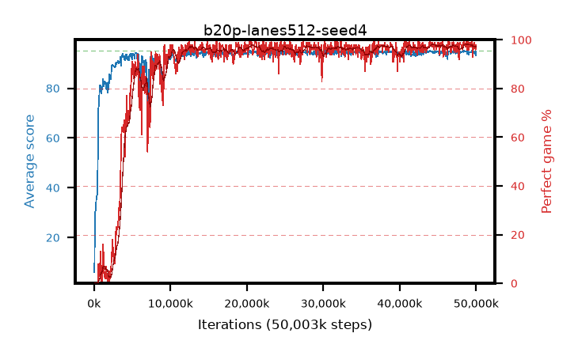

# b20p-lanes512-seed4

step **50,003,968** · 763 evals · trailing **94.49** · peak **94.57** @48,758,784 · sef **88.7** · best30 **97.8** @49,741,824

## Config

| | |
|---|---|
| algo | ppo |
| collect_envs | 512 |
| discount | 0.99 |
| eval_interval | 65536 |
| eval_queue | True |
| eval_queue_depth | 16 |
| eval_workers | 8 |
| fc_layers | (320,) |
| graph_eval_episodes | 100 |
| max_steps | 50003968 |
| min_checkpoint_score | 40.0 |
| ppo_adam_epsilon | 1e-07 |
| ppo_anneal_fraction | 1.0 |
| ppo_clip | 0.2 |
| ppo_clip_final | None |
| ppo_entropy_coef | 0.01 |
| ppo_entropy_coef_final | None |
| ppo_epochs | 4 |
| ppo_gae_lambda | 0.98 |
| ppo_gradient_clipping | 0.5 |
| ppo_horizon | 33.6 |
| ppo_learning_rate | 0.0003 |
| ppo_learning_rate_final | None |
| ppo_minibatch | 256 |
| ppo_normalize_adv | True |
| ppo_rollout | 128 |
| ppo_target_kl | 0.0 |
| ppo_transitions_per_rollout | 65536 |
| ppo_value_loss | huber |
| ppo_vf_coef | 0.5 |
| seed | 4 |
| torch_threads | 1 |

## Evals

| step | avg score | trailing avg | min score | max score | avg reward | perfect % | epsilon |
|---|---|---|---|---|---|---|---|
| 65536 | 6.05 | 6.05 | 1.0 | 14.0 | 2.183 | 0.0 |  |
| 131072 | 29.89 | 22.19 | 2.0 | 60.0 | 24.892 | 0.0 |  |
| 196608 | 30.62 | 18.34 | 7.0 | 52.0 | 25.612 | 0.0 |  |
| ... | ... | ... | ... | ... | ... | ... | ... |
| 49283072 | 94.65 | 94.55 | 78.0 | 95.0 | 190.339 | 97.0 |  |
| 49348608 | 94.34 | 94.53 | 68.0 | 95.0 | 190.064 | 97.0 |  |
| 49414144 | 95.0 | 94.56 | 95.0 | 95.0 | 193.721 | 100.0 |  |
| 49479680 | 94.59 | 94.49 | 61.0 | 95.0 | 191.327 | 98.0 |  |
| 49545216 | 92.65 | 94.48 | 11.0 | 95.0 | 184.357 | 93.0 |  |
| 49610752 | 94.59 | 94.48 | 79.0 | 95.0 | 189.219 | 96.0 |  |
| 49676288 | 94.73 | 94.55 | 73.0 | 95.0 | 191.452 | 98.0 |  |
| 49741824 | 94.63 | 94.51 | 58.0 | 95.0 | 192.348 | 99.0 |  |
| 49807360 | 94.12 | 94.52 | 18.0 | 95.0 | 189.85 | 97.0 |  |
| 49872896 | 94.54 | 94.51 | 62.0 | 95.0 | 190.244 | 97.0 |  |
| 49938432 | 93.24 | 94.49 | 8.0 | 95.0 | 187.923 | 96.0 |  |
| 50003968 | 94.67 | 94.49 | 67.0 | 95.0 | 191.382 | 98.0 |  |
