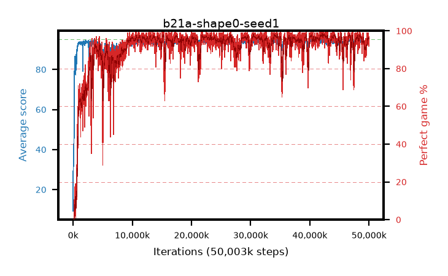

# b21a-shape0-seed1

step **50,003,968** · 3052 evals · trailing **94.1** · peak **94.52** @42,483,712 · sef **91.1** · best30 **97.8** @42,483,712

## Config

| | |
|---|---|
| algo | ppo |
| collect_envs | 128 |
| discount | 0.99 |
| eval_interval | 16384 |
| eval_queue | True |
| eval_queue_depth | 16 |
| eval_workers | 8 |
| fc_layers | (320,) |
| graph_eval_episodes | 100 |
| max_steps | 50003968 |
| min_checkpoint_score | 40.0 |
| ppo_adam_epsilon | 1e-07 |
| ppo_anneal_fraction | 1.0 |
| ppo_clip | 0.2 |
| ppo_clip_final | None |
| ppo_entropy_coef | 0.01 |
| ppo_entropy_coef_final | None |
| ppo_epochs | 4 |
| ppo_gae_lambda | 0.98 |
| ppo_gradient_clipping | 0.5 |
| ppo_horizon | 33.6 |
| ppo_learning_rate | 0.0003 |
| ppo_learning_rate_final | None |
| ppo_minibatch | 256 |
| ppo_normalize_adv | True |
| ppo_rollout | 128 |
| ppo_target_kl | 0.0 |
| ppo_transitions_per_rollout | 16384 |
| ppo_value_loss | huber |
| ppo_vf_coef | 0.5 |
| seed | 1 |
| torch_threads | 1 |

## Evals

| step | avg score | trailing avg | min score | max score | avg reward | perfect % | epsilon |
|---|---|---|---|---|---|---|---|
| 16384 | 9.27 | 9.27 | 0.0 | 25.0 | 8.038 | 0.0 |  |
| 32768 | 42.63 | 31.47 | 18.0 | 85.0 | 37.663 | 0.0 |  |
| 49152 | 37.35 | 23.31 | 13.0 | 76.0 | 32.264 | 0.0 |  |
| ... | ... | ... | ... | ... | ... | ... | ... |
| 49823744 | 94.68 | 93.64 | 79.0 | 95.0 | 190.39 | 97.0 |  |
| 49840128 | 92.93 | 93.78 | 22.0 | 95.0 | 184.57 | 93.0 |  |
| 49856512 | 94.95 | 93.74 | 90.0 | 95.0 | 192.645 | 99.0 |  |
| 49872896 | 93.7 | 93.92 | 14.0 | 95.0 | 187.398 | 95.0 |  |
| 49889280 | 94.81 | 94.01 | 90.0 | 95.0 | 188.478 | 95.0 |  |
| 49905664 | 94.47 | 94.05 | 68.0 | 95.0 | 190.147 | 97.0 |  |
| 49922048 | 94.44 | 94.08 | 77.0 | 95.0 | 189.092 | 96.0 |  |
| 49938432 | 94.75 | 94.09 | 87.0 | 95.0 | 189.409 | 96.0 |  |
| 49954816 | 94.67 | 93.95 | 70.0 | 95.0 | 190.366 | 97.0 |  |
| 49971200 | 94.63 | 94.1 | 80.0 | 95.0 | 190.326 | 97.0 |  |
| 49987584 | 93.94 | 94.11 | 58.0 | 95.0 | 186.602 | 94.0 |  |
| 50003968 | 93.9 | 94.1 | 64.0 | 95.0 | 184.553 | 92.0 |  |
