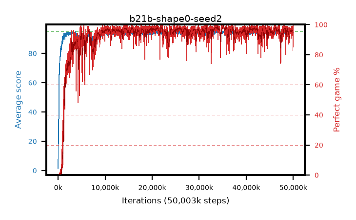

# b21b-shape0-seed2

step **50,003,968** · 3052 evals · trailing **94.14** · peak **94.62** @33,849,344 · sef **93.0** · best30 **98.3** @35,291,136

## Config

| | |
|---|---|
| algo | ppo |
| collect_envs | 128 |
| discount | 0.99 |
| eval_interval | 16384 |
| eval_queue | True |
| eval_queue_depth | 16 |
| eval_workers | 8 |
| fc_layers | (320,) |
| graph_eval_episodes | 100 |
| max_steps | 50003968 |
| min_checkpoint_score | 40.0 |
| ppo_adam_epsilon | 1e-07 |
| ppo_anneal_fraction | 1.0 |
| ppo_clip | 0.2 |
| ppo_clip_final | None |
| ppo_entropy_coef | 0.01 |
| ppo_entropy_coef_final | None |
| ppo_epochs | 4 |
| ppo_gae_lambda | 0.98 |
| ppo_gradient_clipping | 0.5 |
| ppo_horizon | 33.6 |
| ppo_learning_rate | 0.0003 |
| ppo_learning_rate_final | None |
| ppo_minibatch | 256 |
| ppo_normalize_adv | True |
| ppo_rollout | 128 |
| ppo_target_kl | 0.0 |
| ppo_transitions_per_rollout | 16384 |
| ppo_value_loss | huber |
| ppo_vf_coef | 0.5 |
| seed | 2 |
| torch_threads | 1 |

## Evals

| step | avg score | trailing avg | min score | max score | avg reward | perfect % | epsilon |
|---|---|---|---|---|---|---|---|
| 16384 | 1.58 | 1.58 | 0.0 | 6.0 | -1.07 | 0.0 |  |
| 32768 | 16.33 | 15.94 | 6.0 | 32.0 | 11.93 | 0.0 |  |
| 49152 | 21.83 | 11.7 | 4.0 | 41.0 | 16.8 | 0.0 |  |
| ... | ... | ... | ... | ... | ... | ... | ... |
| 49823744 | 94.12 | 94.14 | 59.0 | 95.0 | 188.851 | 96.0 |  |
| 49840128 | 93.82 | 94.12 | 55.0 | 95.0 | 187.559 | 95.0 |  |
| 49856512 | 94.95 | 94.16 | 90.0 | 95.0 | 192.672 | 99.0 |  |
| 49872896 | 94.16 | 94.16 | 62.0 | 95.0 | 187.896 | 95.0 |  |
| 49889280 | 94.03 | 94.17 | 10.0 | 95.0 | 189.755 | 97.0 |  |
| 49905664 | 93.57 | 94.12 | 28.0 | 95.0 | 187.305 | 95.0 |  |
| 49922048 | 92.74 | 94.13 | 76.0 | 95.0 | 174.497 | 83.0 |  |
| 49938432 | 94.02 | 94.15 | 70.0 | 95.0 | 183.748 | 91.0 |  |
| 49954816 | 94.19 | 94.15 | 16.0 | 95.0 | 190.914 | 98.0 |  |
| 49971200 | 94.51 | 94.14 | 74.0 | 95.0 | 189.232 | 96.0 |  |
| 49987584 | 94.9 | 94.18 | 90.0 | 95.0 | 191.609 | 98.0 |  |
| 50003968 | 94.13 | 94.14 | 8.0 | 95.0 | 191.846 | 99.0 |  |
