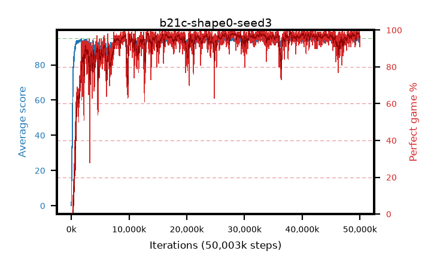

# b21c-shape0-seed3

step **50,003,968** · 3052 evals · trailing **94.43** · peak **94.61** @40,058,880 · sef **93.4** · best30 **98.2** @49,840,128

## Config

| | |
|---|---|
| algo | ppo |
| collect_envs | 128 |
| discount | 0.99 |
| eval_interval | 16384 |
| eval_queue | True |
| eval_queue_depth | 16 |
| eval_workers | 8 |
| fc_layers | (320,) |
| graph_eval_episodes | 100 |
| max_steps | 50003968 |
| min_checkpoint_score | 40.0 |
| ppo_adam_epsilon | 1e-07 |
| ppo_anneal_fraction | 1.0 |
| ppo_clip | 0.2 |
| ppo_clip_final | None |
| ppo_entropy_coef | 0.01 |
| ppo_entropy_coef_final | None |
| ppo_epochs | 4 |
| ppo_gae_lambda | 0.98 |
| ppo_gradient_clipping | 0.5 |
| ppo_horizon | 33.6 |
| ppo_learning_rate | 0.0003 |
| ppo_learning_rate_final | None |
| ppo_minibatch | 256 |
| ppo_normalize_adv | True |
| ppo_rollout | 128 |
| ppo_target_kl | 0.0 |
| ppo_transitions_per_rollout | 16384 |
| ppo_value_loss | huber |
| ppo_vf_coef | 0.5 |
| seed | 3 |
| torch_threads | 1 |

## Evals

| step | avg score | trailing avg | min score | max score | avg reward | perfect % | epsilon |
|---|---|---|---|---|---|---|---|
| 16384 | 0.02 | 0.02 | 0.0 | 1.0 | -4.18 | 0.0 |  |
| 32768 | 3.88 | 1.95 | 0.0 | 15.0 | 2.457 | 0.0 |  |
| 49152 | 19.27 | 11.65 | 0.0 | 39.0 | 14.628 | 0.0 |  |
| ... | ... | ... | ... | ... | ... | ... | ... |
| 49823744 | 94.87 | 94.57 | 82.0 | 95.0 | 192.586 | 99.0 |  |
| 49840128 | 95.0 | 94.55 | 95.0 | 95.0 | 193.713 | 100.0 |  |
| 49856512 | 95.0 | 94.55 | 95.0 | 95.0 | 193.707 | 100.0 |  |
| 49872896 | 92.85 | 94.48 | 18.0 | 95.0 | 185.529 | 94.0 |  |
| 49889280 | 93.74 | 94.38 | 16.0 | 95.0 | 187.464 | 95.0 |  |
| 49905664 | 94.76 | 94.42 | 83.0 | 95.0 | 190.486 | 97.0 |  |
| 49922048 | 94.96 | 94.38 | 91.0 | 95.0 | 192.679 | 99.0 |  |
| 49938432 | 92.68 | 94.33 | 8.0 | 95.0 | 182.349 | 91.0 |  |
| 49954816 | 93.38 | 94.28 | 38.0 | 95.0 | 186.072 | 94.0 |  |
| 49971200 | 93.3 | 94.38 | 10.0 | 95.0 | 186.042 | 94.0 |  |
| 49987584 | 93.96 | 94.46 | 65.0 | 95.0 | 187.683 | 95.0 |  |
| 50003968 | 94.13 | 94.43 | 68.0 | 95.0 | 186.854 | 94.0 |  |
