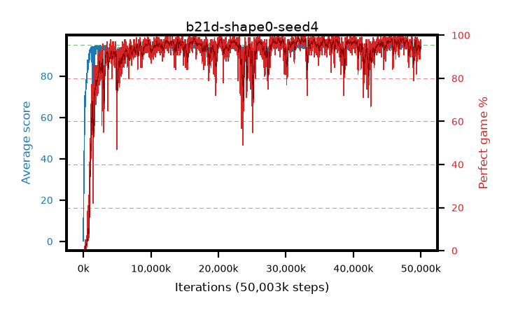

# b21d-shape0-seed4

step **50,003,968** · 3052 evals · trailing **94.03** · peak **94.56** @35,913,728 · sef **93.4** · best30 **98.0** @47,349,760

## Config

| | |
|---|---|
| algo | ppo |
| collect_envs | 128 |
| discount | 0.99 |
| eval_interval | 16384 |
| eval_queue | True |
| eval_queue_depth | 16 |
| eval_workers | 8 |
| fc_layers | (320,) |
| graph_eval_episodes | 100 |
| max_steps | 50003968 |
| min_checkpoint_score | 40.0 |
| ppo_adam_epsilon | 1e-07 |
| ppo_anneal_fraction | 1.0 |
| ppo_clip | 0.2 |
| ppo_clip_final | None |
| ppo_entropy_coef | 0.01 |
| ppo_entropy_coef_final | None |
| ppo_epochs | 4 |
| ppo_gae_lambda | 0.98 |
| ppo_gradient_clipping | 0.5 |
| ppo_horizon | 33.6 |
| ppo_learning_rate | 0.0003 |
| ppo_learning_rate_final | None |
| ppo_minibatch | 256 |
| ppo_normalize_adv | True |
| ppo_rollout | 128 |
| ppo_target_kl | 0.0 |
| ppo_transitions_per_rollout | 16384 |
| ppo_value_loss | huber |
| ppo_vf_coef | 0.5 |
| seed | 4 |
| torch_threads | 1 |

## Evals

| step | avg score | trailing avg | min score | max score | avg reward | perfect % | epsilon |
|---|---|---|---|---|---|---|---|
| 16384 | 0.24 | 0.24 | 0.0 | 2.0 | -0.89 | 0.0 |  |
| 32768 | 18.84 | 9.54 | 0.0 | 32.0 | 13.943 | 0.0 |  |
| 49152 | 23.68 | 14.25 | 9.0 | 44.0 | 18.653 | 0.0 |  |
| ... | ... | ... | ... | ... | ... | ... | ... |
| 49823744 | 94.7 | 94.02 | 86.0 | 95.0 | 189.4 | 96.0 |  |
| 49840128 | 93.48 | 94.01 | 67.0 | 95.0 | 181.187 | 89.0 |  |
| 49856512 | 92.41 | 93.98 | 14.0 | 95.0 | 183.066 | 92.0 |  |
| 49872896 | 94.09 | 94.08 | 49.0 | 95.0 | 185.771 | 93.0 |  |
| 49889280 | 94.35 | 94.0 | 76.0 | 95.0 | 187.072 | 94.0 |  |
| 49905664 | 94.47 | 94.0 | 81.0 | 95.0 | 188.169 | 95.0 |  |
| 49922048 | 93.12 | 93.97 | 32.0 | 95.0 | 186.767 | 95.0 |  |
| 49938432 | 93.05 | 93.93 | 10.0 | 95.0 | 187.781 | 96.0 |  |
| 49954816 | 94.09 | 94.03 | 18.0 | 95.0 | 190.819 | 98.0 |  |
| 49971200 | 93.63 | 93.99 | 16.0 | 95.0 | 187.267 | 95.0 |  |
| 49987584 | 93.5 | 94.0 | 4.0 | 95.0 | 186.188 | 94.0 |  |
| 50003968 | 94.63 | 94.03 | 74.0 | 95.0 | 191.357 | 98.0 |  |
