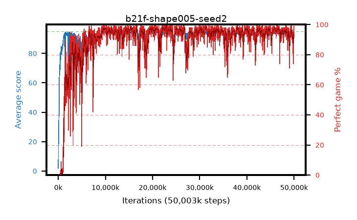

# b21f-shape005-seed2

step **50,003,968** · 3052 evals · trailing **93.48** · peak **94.49** @31,342,592 · sef **89.2** · best30 **97.8** @31,539,200

## Config

| | |
|---|---|
| algo | ppo |
| collect_envs | 128 |
| discount | 0.99 |
| eval_interval | 16384 |
| eval_queue | True |
| eval_queue_depth | 16 |
| eval_workers | 8 |
| fc_layers | (320,) |
| graph_eval_episodes | 100 |
| max_steps | 50003968 |
| min_checkpoint_score | 40.0 |
| ppo_adam_epsilon | 1e-07 |
| ppo_anneal_fraction | 1.0 |
| ppo_clip | 0.2 |
| ppo_clip_final | None |
| ppo_entropy_coef | 0.01 |
| ppo_entropy_coef_final | None |
| ppo_epochs | 4 |
| ppo_gae_lambda | 0.98 |
| ppo_gradient_clipping | 0.5 |
| ppo_horizon | 33.6 |
| ppo_learning_rate | 0.0003 |
| ppo_learning_rate_final | None |
| ppo_minibatch | 256 |
| ppo_normalize_adv | True |
| ppo_rollout | 128 |
| ppo_target_kl | 0.0 |
| ppo_transitions_per_rollout | 16384 |
| ppo_value_loss | huber |
| ppo_vf_coef | 0.5 |
| seed | 2 |
| torch_threads | 1 |

## Evals

| step | avg score | trailing avg | min score | max score | avg reward | perfect % | epsilon |
|---|---|---|---|---|---|---|---|
| 16384 | 1.88 | 1.88 | 0.0 | 9.0 | -1.126 | 0.0 |  |
| 32768 | 15.49 | 14.08 | 4.0 | 31.0 | 10.694 | 0.0 |  |
| 49152 | 21.43 | 15.92 | 4.0 | 46.0 | 16.447 | 0.0 |  |
| ... | ... | ... | ... | ... | ... | ... | ... |
| 49823744 | 90.15 | 93.42 | 16.0 | 95.0 | 162.864 | 74.0 |  |
| 49840128 | 93.68 | 93.54 | 15.0 | 95.0 | 186.341 | 94.0 |  |
| 49856512 | 94.03 | 93.52 | 49.0 | 95.0 | 185.692 | 93.0 |  |
| 49872896 | 92.79 | 93.72 | 16.0 | 95.0 | 177.478 | 86.0 |  |
| 49889280 | 93.15 | 93.55 | 12.0 | 95.0 | 183.758 | 92.0 |  |
| 49905664 | 94.48 | 93.4 | 69.0 | 95.0 | 186.094 | 93.0 |  |
| 49922048 | 94.62 | 93.5 | 68.0 | 95.0 | 190.315 | 97.0 |  |
| 49938432 | 94.36 | 93.41 | 67.0 | 95.0 | 189.059 | 96.0 |  |
| 49954816 | 94.9 | 93.47 | 89.0 | 95.0 | 191.579 | 98.0 |  |
| 49971200 | 94.93 | 93.57 | 88.0 | 95.0 | 192.606 | 99.0 |  |
| 49987584 | 94.37 | 93.48 | 74.0 | 95.0 | 189.072 | 96.0 |  |
| 50003968 | 94.52 | 93.48 | 59.0 | 95.0 | 191.226 | 98.0 |  |
