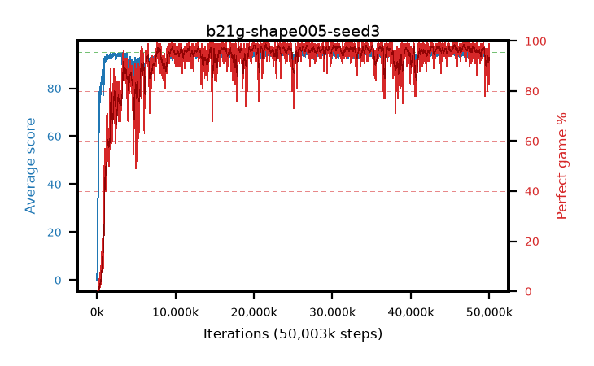

# b21g-shape005-seed3

step **50,003,968** · 3052 evals · trailing **93.67** · peak **94.68** @34,127,872 · sef **92.4** · best30 **97.8** @45,760,512

## Config

| | |
|---|---|
| algo | ppo |
| collect_envs | 128 |
| discount | 0.99 |
| eval_interval | 16384 |
| eval_queue | True |
| eval_queue_depth | 16 |
| eval_workers | 8 |
| fc_layers | (320,) |
| graph_eval_episodes | 100 |
| max_steps | 50003968 |
| min_checkpoint_score | 40.0 |
| ppo_adam_epsilon | 1e-07 |
| ppo_anneal_fraction | 1.0 |
| ppo_clip | 0.2 |
| ppo_clip_final | None |
| ppo_entropy_coef | 0.01 |
| ppo_entropy_coef_final | None |
| ppo_epochs | 4 |
| ppo_gae_lambda | 0.98 |
| ppo_gradient_clipping | 0.5 |
| ppo_horizon | 33.6 |
| ppo_learning_rate | 0.0003 |
| ppo_learning_rate_final | None |
| ppo_minibatch | 256 |
| ppo_normalize_adv | True |
| ppo_rollout | 128 |
| ppo_target_kl | 0.0 |
| ppo_transitions_per_rollout | 16384 |
| ppo_value_loss | huber |
| ppo_vf_coef | 0.5 |
| seed | 3 |
| torch_threads | 1 |

## Evals

| step | avg score | trailing avg | min score | max score | avg reward | perfect % | epsilon |
|---|---|---|---|---|---|---|---|
| 16384 | 0.04 | 0.04 | 0.0 | 1.0 | -4.294 | 0.0 |  |
| 32768 | 4.39 | 2.21 | 0.0 | 13.0 | 2.735 | 0.0 |  |
| 49152 | 18.9 | 15.86 | 0.0 | 38.0 | 14.434 | 0.0 |  |
| ... | ... | ... | ... | ... | ... | ... | ... |
| 49823744 | 93.93 | 93.62 | 71.0 | 95.0 | 185.623 | 93.0 |  |
| 49840128 | 93.75 | 93.6 | 76.0 | 95.0 | 181.429 | 89.0 |  |
| 49856512 | 94.07 | 93.61 | 79.0 | 95.0 | 183.785 | 91.0 |  |
| 49872896 | 92.97 | 93.59 | 10.0 | 95.0 | 180.684 | 89.0 |  |
| 49889280 | 94.79 | 93.65 | 83.0 | 95.0 | 190.433 | 97.0 |  |
| 49905664 | 94.52 | 93.71 | 77.0 | 95.0 | 188.223 | 95.0 |  |
| 49922048 | 94.97 | 93.67 | 92.0 | 95.0 | 192.679 | 99.0 |  |
| 49938432 | 94.65 | 93.63 | 78.0 | 95.0 | 190.354 | 97.0 |  |
| 49954816 | 94.91 | 93.74 | 86.0 | 95.0 | 192.608 | 99.0 |  |
| 49971200 | 92.84 | 93.65 | 69.0 | 95.0 | 175.552 | 84.0 |  |
| 49987584 | 92.32 | 93.7 | 69.0 | 95.0 | 174.061 | 83.0 |  |
| 50003968 | 93.39 | 93.67 | 16.0 | 95.0 | 183.12 | 91.0 |  |
