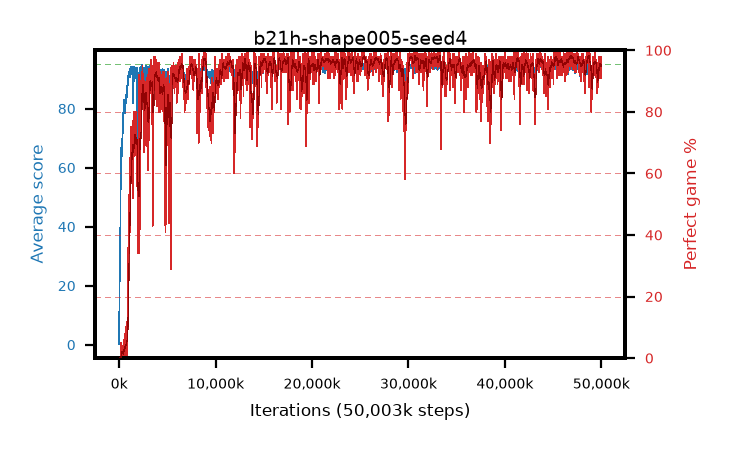

# b21h-shape005-seed4

step **50,003,968** · 3052 evals · trailing **93.62** · peak **94.48** @25,395,200 · sef **92.4** · best30 **97.9** @47,038,464

## Config

| | |
|---|---|
| algo | ppo |
| collect_envs | 128 |
| discount | 0.99 |
| eval_interval | 16384 |
| eval_queue | True |
| eval_queue_depth | 16 |
| eval_workers | 8 |
| fc_layers | (320,) |
| graph_eval_episodes | 100 |
| max_steps | 50003968 |
| min_checkpoint_score | 40.0 |
| ppo_adam_epsilon | 1e-07 |
| ppo_anneal_fraction | 1.0 |
| ppo_clip | 0.2 |
| ppo_clip_final | None |
| ppo_entropy_coef | 0.01 |
| ppo_entropy_coef_final | None |
| ppo_epochs | 4 |
| ppo_gae_lambda | 0.98 |
| ppo_gradient_clipping | 0.5 |
| ppo_horizon | 33.6 |
| ppo_learning_rate | 0.0003 |
| ppo_learning_rate_final | None |
| ppo_minibatch | 256 |
| ppo_normalize_adv | True |
| ppo_rollout | 128 |
| ppo_target_kl | 0.0 |
| ppo_transitions_per_rollout | 16384 |
| ppo_value_loss | huber |
| ppo_vf_coef | 0.5 |
| seed | 4 |
| torch_threads | 1 |

## Evals

| step | avg score | trailing avg | min score | max score | avg reward | perfect % | epsilon |
|---|---|---|---|---|---|---|---|
| 16384 | 0.21 | 0.21 | 0.0 | 2.0 | -0.518 | 0.0 |  |
| 32768 | 18.61 | 9.41 | 0.0 | 33.0 | 13.849 | 0.0 |  |
| 49152 | 22.85 | 13.89 | 9.0 | 37.0 | 17.825 | 0.0 |  |
| ... | ... | ... | ... | ... | ... | ... | ... |
| 49823744 | 94.59 | 93.53 | 74.0 | 95.0 | 189.294 | 96.0 |  |
| 49840128 | 93.77 | 93.51 | 5.0 | 95.0 | 188.47 | 96.0 |  |
| 49856512 | 94.49 | 93.55 | 60.0 | 95.0 | 189.201 | 96.0 |  |
| 49872896 | 93.67 | 93.5 | 32.0 | 95.0 | 186.388 | 94.0 |  |
| 49889280 | 94.17 | 93.54 | 82.0 | 95.0 | 183.854 | 91.0 |  |
| 49905664 | 94.02 | 93.52 | 8.0 | 95.0 | 189.719 | 97.0 |  |
| 49922048 | 94.09 | 93.51 | 58.0 | 95.0 | 186.76 | 94.0 |  |
| 49938432 | 93.64 | 93.56 | 6.0 | 95.0 | 188.355 | 96.0 |  |
| 49954816 | 94.66 | 93.57 | 71.0 | 95.0 | 191.365 | 98.0 |  |
| 49971200 | 93.53 | 93.56 | 66.0 | 95.0 | 183.249 | 91.0 |  |
| 49987584 | 93.92 | 93.63 | 8.0 | 95.0 | 186.54 | 94.0 |  |
| 50003968 | 94.82 | 93.62 | 87.0 | 95.0 | 190.52 | 97.0 |  |
