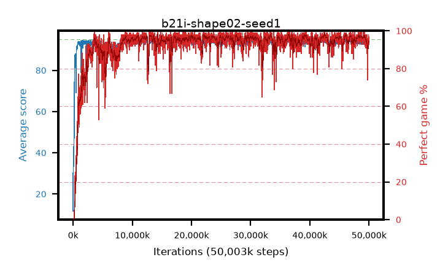

# b21i-shape02-seed1

step **50,003,968** · 3052 evals · trailing **93.67** · peak **94.5** @26,411,008 · sef **94.3** · best30 **97.5** @39,419,904

## Config

| | |
|---|---|
| algo | ppo |
| collect_envs | 128 |
| discount | 0.99 |
| eval_interval | 16384 |
| eval_queue | True |
| eval_queue_depth | 16 |
| eval_workers | 8 |
| fc_layers | (320,) |
| graph_eval_episodes | 100 |
| max_steps | 50003968 |
| min_checkpoint_score | 40.0 |
| ppo_adam_epsilon | 1e-07 |
| ppo_anneal_fraction | 1.0 |
| ppo_clip | 0.2 |
| ppo_clip_final | None |
| ppo_entropy_coef | 0.01 |
| ppo_entropy_coef_final | None |
| ppo_epochs | 4 |
| ppo_gae_lambda | 0.98 |
| ppo_gradient_clipping | 0.5 |
| ppo_horizon | 33.6 |
| ppo_learning_rate | 0.0003 |
| ppo_learning_rate_final | None |
| ppo_minibatch | 256 |
| ppo_normalize_adv | True |
| ppo_rollout | 128 |
| ppo_target_kl | 0.0 |
| ppo_transitions_per_rollout | 16384 |
| ppo_value_loss | huber |
| ppo_vf_coef | 0.5 |
| seed | 1 |
| torch_threads | 1 |

## Evals

| step | avg score | trailing avg | min score | max score | avg reward | perfect % | epsilon |
|---|---|---|---|---|---|---|---|
| 16384 | 11.71 | 22.54 | 0.0 | 30.0 | 10.487 | 0.0 |  |
| 32768 | 43.03 | 34.63 | 4.0 | 86.0 | 38.095 | 0.0 |  |
| 49152 | 38.66 | 29.3 | 14.0 | 76.0 | 33.612 | 0.0 |  |
| ... | ... | ... | ... | ... | ... | ... | ... |
| 49823744 | 94.22 | 93.59 | 75.0 | 95.0 | 186.886 | 94.0 |  |
| 49840128 | 93.44 | 93.6 | 12.0 | 95.0 | 185.152 | 93.0 |  |
| 49856512 | 94.51 | 93.63 | 78.0 | 95.0 | 189.209 | 96.0 |  |
| 49872896 | 94.44 | 93.64 | 74.0 | 95.0 | 189.132 | 96.0 |  |
| 49889280 | 91.99 | 93.56 | 10.0 | 95.0 | 183.584 | 93.0 |  |
| 49905664 | 93.95 | 93.59 | 67.0 | 95.0 | 186.58 | 94.0 |  |
| 49922048 | 94.22 | 93.54 | 22.0 | 95.0 | 190.876 | 98.0 |  |
| 49938432 | 94.44 | 93.51 | 61.0 | 95.0 | 187.111 | 94.0 |  |
| 49954816 | 93.66 | 93.5 | 24.0 | 95.0 | 185.376 | 93.0 |  |
| 49971200 | 94.37 | 93.61 | 77.0 | 95.0 | 186.063 | 93.0 |  |
| 49987584 | 94.62 | 93.64 | 76.0 | 95.0 | 188.314 | 95.0 |  |
| 50003968 | 93.88 | 93.67 | 68.0 | 95.0 | 186.538 | 94.0 |  |
