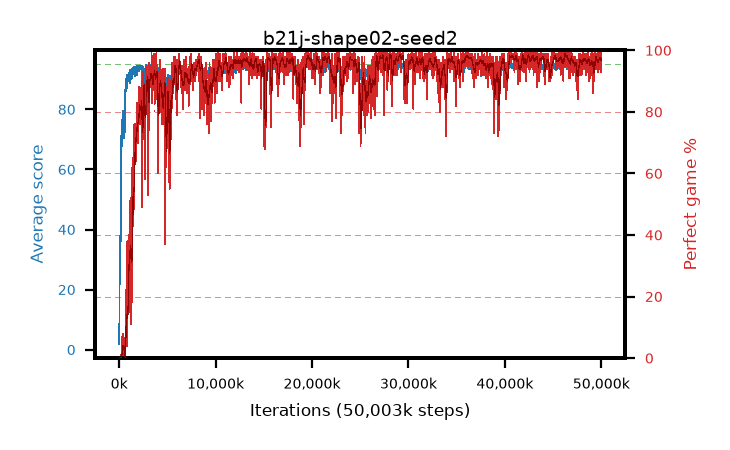

# b21j-shape02-seed2

step **50,003,968** · 3052 evals · trailing **94.46** · peak **94.62** @46,628,864 · sef **92.8** · best30 **98.0** @29,442,048

## Config

| | |
|---|---|
| algo | ppo |
| collect_envs | 128 |
| discount | 0.99 |
| eval_interval | 16384 |
| eval_queue | True |
| eval_queue_depth | 16 |
| eval_workers | 8 |
| fc_layers | (320,) |
| graph_eval_episodes | 100 |
| max_steps | 50003968 |
| min_checkpoint_score | 40.0 |
| ppo_adam_epsilon | 1e-07 |
| ppo_anneal_fraction | 1.0 |
| ppo_clip | 0.2 |
| ppo_clip_final | None |
| ppo_entropy_coef | 0.01 |
| ppo_entropy_coef_final | None |
| ppo_epochs | 4 |
| ppo_gae_lambda | 0.98 |
| ppo_gradient_clipping | 0.5 |
| ppo_horizon | 33.6 |
| ppo_learning_rate | 0.0003 |
| ppo_learning_rate_final | None |
| ppo_minibatch | 256 |
| ppo_normalize_adv | True |
| ppo_rollout | 128 |
| ppo_target_kl | 0.0 |
| ppo_transitions_per_rollout | 16384 |
| ppo_value_loss | huber |
| ppo_vf_coef | 0.5 |
| seed | 2 |
| torch_threads | 1 |

## Evals

| step | avg score | trailing avg | min score | max score | avg reward | perfect % | epsilon |
|---|---|---|---|---|---|---|---|
| 16384 | 1.85 | 1.85 | 0.0 | 6.0 | -0.757 | 0.0 |  |
| 32768 | 16.58 | 9.21 | 2.0 | 35.0 | 11.919 | 0.0 |  |
| 49152 | 25.5 | 14.64 | 7.0 | 43.0 | 20.505 | 0.0 |  |
| ... | ... | ... | ... | ... | ... | ... | ... |
| 49823744 | 94.54 | 94.48 | 78.0 | 95.0 | 189.262 | 96.0 |  |
| 49840128 | 94.31 | 94.56 | 68.0 | 95.0 | 187.044 | 94.0 |  |
| 49856512 | 94.91 | 94.53 | 86.0 | 95.0 | 192.634 | 99.0 |  |
| 49872896 | 94.76 | 94.47 | 71.0 | 95.0 | 192.485 | 99.0 |  |
| 49889280 | 94.64 | 94.48 | 77.0 | 95.0 | 190.353 | 97.0 |  |
| 49905664 | 94.38 | 94.47 | 60.0 | 95.0 | 191.098 | 98.0 |  |
| 49922048 | 94.29 | 94.54 | 64.0 | 95.0 | 188.01 | 95.0 |  |
| 49938432 | 94.83 | 94.55 | 83.0 | 95.0 | 191.549 | 98.0 |  |
| 49954816 | 94.62 | 94.56 | 75.0 | 95.0 | 190.289 | 97.0 |  |
| 49971200 | 94.88 | 94.56 | 86.0 | 95.0 | 191.599 | 98.0 |  |
| 49987584 | 93.65 | 94.43 | 20.0 | 95.0 | 185.337 | 93.0 |  |
| 50003968 | 94.63 | 94.46 | 58.0 | 95.0 | 192.352 | 99.0 |  |
