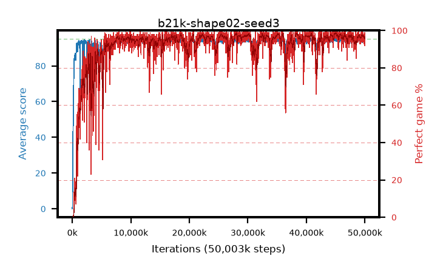

# b21k-shape02-seed3

step **50,003,968** · 3052 evals · trailing **94.3** · peak **94.7** @45,268,992 · sef **91.3** · best30 **98.4** @45,072,384

## Config

| | |
|---|---|
| algo | ppo |
| collect_envs | 128 |
| discount | 0.99 |
| eval_interval | 16384 |
| eval_queue | True |
| eval_queue_depth | 16 |
| eval_workers | 8 |
| fc_layers | (320,) |
| graph_eval_episodes | 100 |
| max_steps | 50003968 |
| min_checkpoint_score | 40.0 |
| ppo_adam_epsilon | 1e-07 |
| ppo_anneal_fraction | 1.0 |
| ppo_clip | 0.2 |
| ppo_clip_final | None |
| ppo_entropy_coef | 0.01 |
| ppo_entropy_coef_final | None |
| ppo_epochs | 4 |
| ppo_gae_lambda | 0.98 |
| ppo_gradient_clipping | 0.5 |
| ppo_horizon | 33.6 |
| ppo_learning_rate | 0.0003 |
| ppo_learning_rate_final | None |
| ppo_minibatch | 256 |
| ppo_normalize_adv | True |
| ppo_rollout | 128 |
| ppo_target_kl | 0.0 |
| ppo_transitions_per_rollout | 16384 |
| ppo_value_loss | huber |
| ppo_vf_coef | 0.5 |
| seed | 3 |
| torch_threads | 1 |

## Evals

| step | avg score | trailing avg | min score | max score | avg reward | perfect % | epsilon |
|---|---|---|---|---|---|---|---|
| 16384 | 0.03 | 0.03 | 0.0 | 1.0 | -4.304 | 0.0 |  |
| 32768 | 1.67 | 0.85 | 0.0 | 8.0 | 1.063 | 0.0 |  |
| 49152 | 17.78 | 15.14 | 0.0 | 38.0 | 13.42 | 0.0 |  |
| ... | ... | ... | ... | ... | ... | ... | ... |
| 49823744 | 94.34 | 94.42 | 59.0 | 95.0 | 191.058 | 98.0 |  |
| 49840128 | 94.65 | 94.43 | 65.0 | 95.0 | 191.371 | 98.0 |  |
| 49856512 | 94.28 | 94.41 | 65.0 | 95.0 | 189.0 | 96.0 |  |
| 49872896 | 93.77 | 94.41 | 63.0 | 95.0 | 186.491 | 94.0 |  |
| 49889280 | 94.24 | 94.38 | 72.0 | 95.0 | 186.95 | 94.0 |  |
| 49905664 | 94.16 | 94.4 | 56.0 | 95.0 | 188.876 | 96.0 |  |
| 49922048 | 94.78 | 94.34 | 73.0 | 95.0 | 192.496 | 99.0 |  |
| 49938432 | 94.55 | 94.31 | 80.0 | 95.0 | 189.26 | 96.0 |  |
| 49954816 | 94.89 | 94.34 | 84.0 | 95.0 | 192.603 | 99.0 |  |
| 49971200 | 94.63 | 94.34 | 74.0 | 95.0 | 189.346 | 96.0 |  |
| 49987584 | 93.8 | 94.3 | 66.0 | 95.0 | 185.522 | 93.0 |  |
| 50003968 | 93.9 | 94.3 | 50.0 | 95.0 | 184.617 | 92.0 |  |
