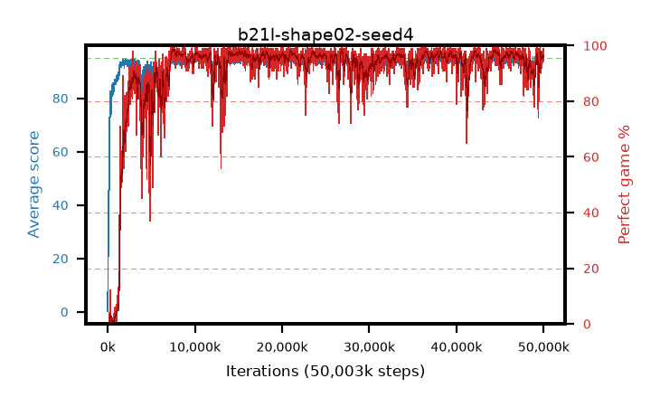

# b21l-shape02-seed4

step **50,003,968** · 3052 evals · trailing **94.21** · peak **94.49** @44,515,328 · sef **92.1** · best30 **98.3** @7,700,480

## Config

| | |
|---|---|
| algo | ppo |
| collect_envs | 128 |
| discount | 0.99 |
| eval_interval | 16384 |
| eval_queue | True |
| eval_queue_depth | 16 |
| eval_workers | 8 |
| fc_layers | (320,) |
| graph_eval_episodes | 100 |
| max_steps | 50003968 |
| min_checkpoint_score | 40.0 |
| ppo_adam_epsilon | 1e-07 |
| ppo_anneal_fraction | 1.0 |
| ppo_clip | 0.2 |
| ppo_clip_final | None |
| ppo_entropy_coef | 0.01 |
| ppo_entropy_coef_final | None |
| ppo_epochs | 4 |
| ppo_gae_lambda | 0.98 |
| ppo_gradient_clipping | 0.5 |
| ppo_horizon | 33.6 |
| ppo_learning_rate | 0.0003 |
| ppo_learning_rate_final | None |
| ppo_minibatch | 256 |
| ppo_normalize_adv | True |
| ppo_rollout | 128 |
| ppo_target_kl | 0.0 |
| ppo_transitions_per_rollout | 16384 |
| ppo_value_loss | huber |
| ppo_vf_coef | 0.5 |
| seed | 4 |
| torch_threads | 1 |

## Evals

| step | avg score | trailing avg | min score | max score | avg reward | perfect % | epsilon |
|---|---|---|---|---|---|---|---|
| 16384 | 0.23 | 0.23 | 0.0 | 1.0 | -0.588 | 0.0 |  |
| 32768 | 18.92 | 9.58 | 1.0 | 35.0 | 14.429 | 0.0 |  |
| 49152 | 24.77 | 21.31 | 6.0 | 49.0 | 19.824 | 0.0 |  |
| ... | ... | ... | ... | ... | ... | ... | ... |
| 49823744 | 93.68 | 93.52 | 28.0 | 95.0 | 187.405 | 95.0 |  |
| 49840128 | 94.14 | 93.69 | 70.0 | 95.0 | 187.86 | 95.0 |  |
| 49856512 | 94.33 | 93.65 | 64.0 | 95.0 | 190.062 | 97.0 |  |
| 49872896 | 93.99 | 94.24 | 53.0 | 95.0 | 188.676 | 96.0 |  |
| 49889280 | 94.3 | 94.18 | 56.0 | 95.0 | 191.02 | 98.0 |  |
| 49905664 | 94.51 | 94.19 | 73.0 | 95.0 | 190.232 | 97.0 |  |
| 49922048 | 94.21 | 94.2 | 71.0 | 95.0 | 186.93 | 94.0 |  |
| 49938432 | 94.54 | 93.8 | 78.0 | 95.0 | 189.257 | 96.0 |  |
| 49954816 | 94.49 | 93.94 | 65.0 | 95.0 | 189.206 | 96.0 |  |
| 49971200 | 94.07 | 94.0 | 60.0 | 95.0 | 187.784 | 95.0 |  |
| 49987584 | 94.15 | 94.1 | 10.0 | 95.0 | 191.863 | 99.0 |  |
| 50003968 | 94.65 | 94.21 | 75.0 | 95.0 | 188.314 | 95.0 |  |
