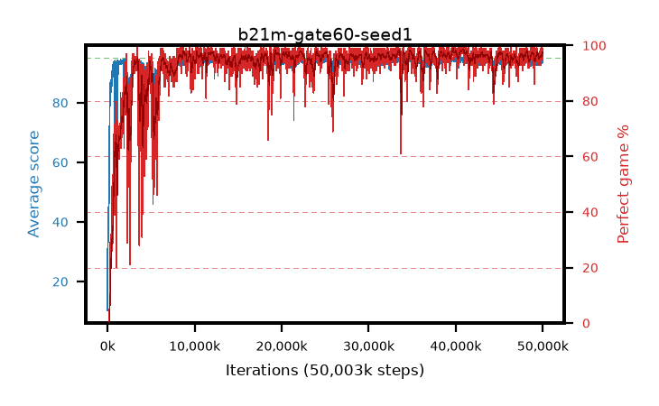

# b21m-gate60-seed1

step **50,003,968** · 3052 evals · trailing **94.23** · peak **94.66** @40,812,544 · sef **93.7** · best30 **98.3** @40,812,544

## Config

| | |
|---|---|
| algo | ppo |
| collect_envs | 128 |
| discount | 0.99 |
| eval_interval | 16384 |
| eval_queue | True |
| eval_queue_depth | 16 |
| eval_workers | 8 |
| fc_layers | (320,) |
| graph_eval_episodes | 100 |
| max_steps | 50003968 |
| min_checkpoint_score | 40.0 |
| ppo_adam_epsilon | 1e-07 |
| ppo_anneal_fraction | 1.0 |
| ppo_clip | 0.2 |
| ppo_clip_final | None |
| ppo_entropy_coef | 0.01 |
| ppo_entropy_coef_final | None |
| ppo_epochs | 4 |
| ppo_gae_lambda | 0.98 |
| ppo_gradient_clipping | 0.5 |
| ppo_horizon | 33.6 |
| ppo_learning_rate | 0.0003 |
| ppo_learning_rate_final | None |
| ppo_minibatch | 256 |
| ppo_normalize_adv | True |
| ppo_rollout | 128 |
| ppo_target_kl | 0.0 |
| ppo_transitions_per_rollout | 16384 |
| ppo_value_loss | huber |
| ppo_vf_coef | 0.5 |
| seed | 1 |
| torch_threads | 1 |

## Evals

| step | avg score | trailing avg | min score | max score | avg reward | perfect % | epsilon |
|---|---|---|---|---|---|---|---|
| 16384 | 10.29 | 10.29 | 0.0 | 25.0 | 8.873 | 0.0 |  |
| 32768 | 44.83 | 32.91 | 8.0 | 83.0 | 39.754 | 0.0 |  |
| 49152 | 34.59 | 22.44 | 10.0 | 75.0 | 29.514 | 0.0 |  |
| ... | ... | ... | ... | ... | ... | ... | ... |
| 49823744 | 94.26 | 94.14 | 26.0 | 95.0 | 190.968 | 98.0 |  |
| 49840128 | 93.16 | 94.06 | 12.0 | 95.0 | 187.89 | 96.0 |  |
| 49856512 | 93.62 | 94.11 | 20.0 | 95.0 | 189.347 | 97.0 |  |
| 49872896 | 95.0 | 94.14 | 95.0 | 95.0 | 193.687 | 100.0 |  |
| 49889280 | 94.92 | 94.19 | 90.0 | 95.0 | 191.621 | 98.0 |  |
| 49905664 | 94.82 | 94.15 | 87.0 | 95.0 | 190.488 | 97.0 |  |
| 49922048 | 93.94 | 94.2 | 62.0 | 95.0 | 187.654 | 95.0 |  |
| 49938432 | 94.24 | 94.23 | 56.0 | 95.0 | 189.952 | 97.0 |  |
| 49954816 | 94.65 | 94.21 | 60.0 | 95.0 | 192.36 | 99.0 |  |
| 49971200 | 94.81 | 94.28 | 85.0 | 95.0 | 191.511 | 98.0 |  |
| 49987584 | 93.55 | 94.26 | 6.0 | 95.0 | 189.251 | 97.0 |  |
| 50003968 | 93.84 | 94.23 | 16.0 | 95.0 | 188.554 | 96.0 |  |
