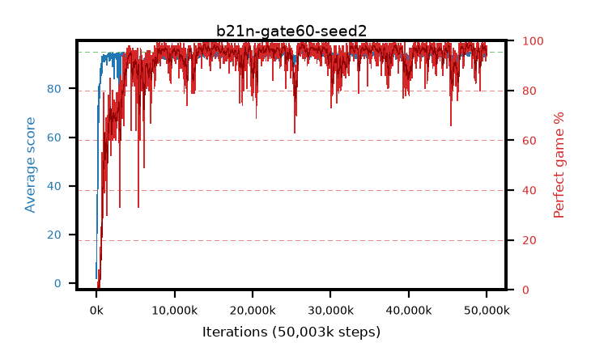

# b21n-gate60-seed2

step **50,003,968** · 3052 evals · trailing **94.25** · peak **94.49** @26,279,936 · sef **91.5** · best30 **98.1** @26,624,000

## Config

| | |
|---|---|
| algo | ppo |
| collect_envs | 128 |
| discount | 0.99 |
| eval_interval | 16384 |
| eval_queue | True |
| eval_queue_depth | 16 |
| eval_workers | 8 |
| fc_layers | (320,) |
| graph_eval_episodes | 100 |
| max_steps | 50003968 |
| min_checkpoint_score | 40.0 |
| ppo_adam_epsilon | 1e-07 |
| ppo_anneal_fraction | 1.0 |
| ppo_clip | 0.2 |
| ppo_clip_final | None |
| ppo_entropy_coef | 0.01 |
| ppo_entropy_coef_final | None |
| ppo_epochs | 4 |
| ppo_gae_lambda | 0.98 |
| ppo_gradient_clipping | 0.5 |
| ppo_horizon | 33.6 |
| ppo_learning_rate | 0.0003 |
| ppo_learning_rate_final | None |
| ppo_minibatch | 256 |
| ppo_normalize_adv | True |
| ppo_rollout | 128 |
| ppo_target_kl | 0.0 |
| ppo_transitions_per_rollout | 16384 |
| ppo_value_loss | huber |
| ppo_vf_coef | 0.5 |
| seed | 2 |
| torch_threads | 1 |

## Evals

| step | avg score | trailing avg | min score | max score | avg reward | perfect % | epsilon |
|---|---|---|---|---|---|---|---|
| 16384 | 1.93 | 1.93 | 0.0 | 6.0 | -0.765 | 0.0 |  |
| 32768 | 16.31 | 9.12 | 4.0 | 36.0 | 11.826 | 0.0 |  |
| 49152 | 23.93 | 14.06 | 4.0 | 53.0 | 18.894 | 0.0 |  |
| ... | ... | ... | ... | ... | ... | ... | ... |
| 49823744 | 94.56 | 94.43 | 72.0 | 95.0 | 189.284 | 96.0 |  |
| 49840128 | 93.01 | 94.31 | 32.0 | 95.0 | 183.701 | 92.0 |  |
| 49856512 | 92.7 | 94.37 | 16.0 | 95.0 | 183.315 | 92.0 |  |
| 49872896 | 93.49 | 94.27 | 22.0 | 95.0 | 186.167 | 94.0 |  |
| 49889280 | 94.74 | 94.21 | 75.0 | 95.0 | 191.453 | 98.0 |  |
| 49905664 | 93.17 | 94.22 | 6.0 | 95.0 | 184.919 | 93.0 |  |
| 49922048 | 93.28 | 94.16 | 34.0 | 95.0 | 186.886 | 95.0 |  |
| 49938432 | 94.08 | 94.24 | 54.0 | 95.0 | 186.692 | 94.0 |  |
| 49954816 | 93.83 | 94.27 | 16.0 | 95.0 | 190.562 | 98.0 |  |
| 49971200 | 94.39 | 94.22 | 71.0 | 95.0 | 187.109 | 94.0 |  |
| 49987584 | 94.63 | 94.24 | 87.0 | 95.0 | 187.356 | 94.0 |  |
| 50003968 | 94.27 | 94.25 | 76.0 | 95.0 | 186.993 | 94.0 |  |
