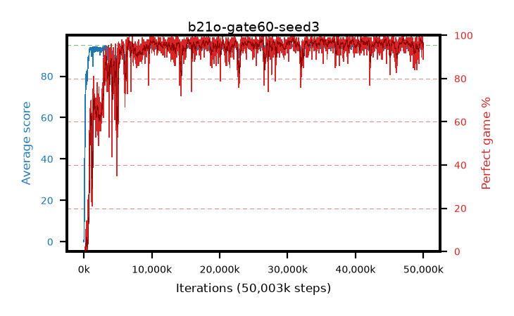

# b21o-gate60-seed3

step **50,003,968** · 3052 evals · trailing **94.14** · peak **94.63** @30,736,384 · sef **92.0** · best30 **97.9** @35,241,984

## Config

| | |
|---|---|
| algo | ppo |
| collect_envs | 128 |
| discount | 0.99 |
| eval_interval | 16384 |
| eval_queue | True |
| eval_queue_depth | 16 |
| eval_workers | 8 |
| fc_layers | (320,) |
| graph_eval_episodes | 100 |
| max_steps | 50003968 |
| min_checkpoint_score | 40.0 |
| ppo_adam_epsilon | 1e-07 |
| ppo_anneal_fraction | 1.0 |
| ppo_clip | 0.2 |
| ppo_clip_final | None |
| ppo_entropy_coef | 0.01 |
| ppo_entropy_coef_final | None |
| ppo_epochs | 4 |
| ppo_gae_lambda | 0.98 |
| ppo_gradient_clipping | 0.5 |
| ppo_horizon | 33.6 |
| ppo_learning_rate | 0.0003 |
| ppo_learning_rate_final | None |
| ppo_minibatch | 256 |
| ppo_normalize_adv | True |
| ppo_rollout | 128 |
| ppo_target_kl | 0.0 |
| ppo_transitions_per_rollout | 16384 |
| ppo_value_loss | huber |
| ppo_vf_coef | 0.5 |
| seed | 3 |
| torch_threads | 1 |

## Evals

| step | avg score | trailing avg | min score | max score | avg reward | perfect % | epsilon |
|---|---|---|---|---|---|---|---|
| 16384 | 0.05 | 0.05 | 0.0 | 1.0 | -4.24 | 0.0 |  |
| 32768 | 1.55 | 0.8 | 0.0 | 7.0 | 0.899 | 0.0 |  |
| 49152 | 18.8 | 15.36 | 0.0 | 40.0 | 14.165 | 0.0 |  |
| ... | ... | ... | ... | ... | ... | ... | ... |
| 49823744 | 95.0 | 94.36 | 95.0 | 95.0 | 193.711 | 100.0 |  |
| 49840128 | 94.47 | 94.39 | 67.0 | 95.0 | 191.192 | 98.0 |  |
| 49856512 | 94.64 | 94.38 | 77.0 | 95.0 | 190.376 | 97.0 |  |
| 49872896 | 93.74 | 94.34 | 9.0 | 95.0 | 187.433 | 95.0 |  |
| 49889280 | 94.25 | 94.32 | 59.0 | 95.0 | 188.986 | 96.0 |  |
| 49905664 | 93.52 | 94.28 | 14.0 | 95.0 | 187.266 | 95.0 |  |
| 49922048 | 94.74 | 94.35 | 69.0 | 95.0 | 192.459 | 99.0 |  |
| 49938432 | 93.0 | 94.21 | 16.0 | 95.0 | 181.712 | 90.0 |  |
| 49954816 | 93.96 | 94.17 | 78.0 | 95.0 | 182.692 | 90.0 |  |
| 49971200 | 94.21 | 94.2 | 74.0 | 95.0 | 186.946 | 94.0 |  |
| 49987584 | 93.53 | 94.18 | 74.0 | 95.0 | 181.278 | 89.0 |  |
| 50003968 | 93.87 | 94.14 | 32.0 | 95.0 | 188.604 | 96.0 |  |
