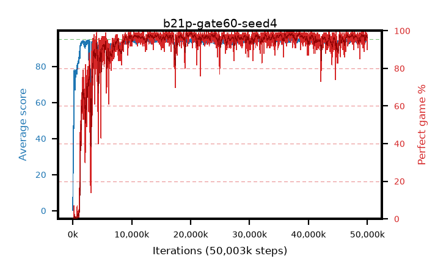

# b21p-gate60-seed4

step **50,003,968** · 3052 evals · trailing **94.14** · peak **94.55** @20,332,544 · sef **92.9** · best30 **98.5** @20,217,856

## Config

| | |
|---|---|
| algo | ppo |
| collect_envs | 128 |
| discount | 0.99 |
| eval_interval | 16384 |
| eval_queue | True |
| eval_queue_depth | 16 |
| eval_workers | 8 |
| fc_layers | (320,) |
| graph_eval_episodes | 100 |
| max_steps | 50003968 |
| min_checkpoint_score | 40.0 |
| ppo_adam_epsilon | 1e-07 |
| ppo_anneal_fraction | 1.0 |
| ppo_clip | 0.2 |
| ppo_clip_final | None |
| ppo_entropy_coef | 0.01 |
| ppo_entropy_coef_final | None |
| ppo_epochs | 4 |
| ppo_gae_lambda | 0.98 |
| ppo_gradient_clipping | 0.5 |
| ppo_horizon | 33.6 |
| ppo_learning_rate | 0.0003 |
| ppo_learning_rate_final | None |
| ppo_minibatch | 256 |
| ppo_normalize_adv | True |
| ppo_rollout | 128 |
| ppo_target_kl | 0.0 |
| ppo_transitions_per_rollout | 16384 |
| ppo_value_loss | huber |
| ppo_vf_coef | 0.5 |
| seed | 4 |
| torch_threads | 1 |

## Evals

| step | avg score | trailing avg | min score | max score | avg reward | perfect % | epsilon |
|---|---|---|---|---|---|---|---|
| 16384 | 0.23 | 0.23 | 0.0 | 2.0 | -0.499 | 0.0 |  |
| 32768 | 17.37 | 14.1 | 1.0 | 33.0 | 13.195 | 0.0 |  |
| 49152 | 24.71 | 12.47 | 8.0 | 41.0 | 19.682 | 0.0 |  |
| ... | ... | ... | ... | ... | ... | ... | ... |
| 49823744 | 94.12 | 94.04 | 70.0 | 95.0 | 188.845 | 96.0 |  |
| 49840128 | 94.84 | 94.08 | 84.0 | 95.0 | 191.577 | 98.0 |  |
| 49856512 | 93.89 | 94.04 | 12.0 | 95.0 | 190.599 | 98.0 |  |
| 49872896 | 94.92 | 94.08 | 87.0 | 95.0 | 192.637 | 99.0 |  |
| 49889280 | 94.66 | 94.11 | 71.0 | 95.0 | 190.38 | 97.0 |  |
| 49905664 | 94.77 | 94.11 | 83.0 | 95.0 | 191.49 | 98.0 |  |
| 49922048 | 94.64 | 94.09 | 76.0 | 95.0 | 191.361 | 98.0 |  |
| 49938432 | 93.99 | 94.09 | 6.0 | 95.0 | 190.707 | 98.0 |  |
| 49954816 | 93.65 | 94.07 | 74.0 | 95.0 | 182.376 | 90.0 |  |
| 49971200 | 94.43 | 94.26 | 72.0 | 95.0 | 189.131 | 96.0 |  |
| 49987584 | 93.75 | 94.25 | 62.0 | 95.0 | 183.477 | 91.0 |  |
| 50003968 | 94.69 | 94.14 | 77.0 | 95.0 | 190.395 | 97.0 |  |
