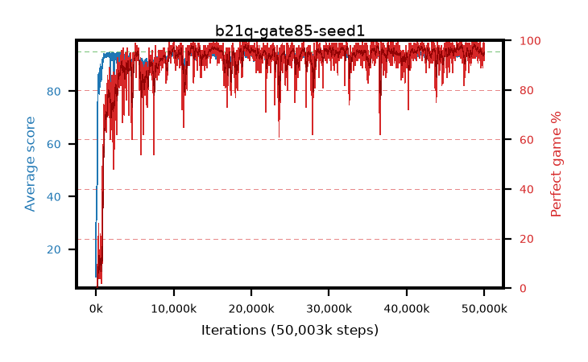

# b21q-gate85-seed1

step **50,003,968** · 3052 evals · trailing **93.97** · peak **94.42** @45,891,584 · sef **93.1** · best30 **97.6** @19,333,120

## Config

| | |
|---|---|
| algo | ppo |
| collect_envs | 128 |
| discount | 0.99 |
| eval_interval | 16384 |
| eval_queue | True |
| eval_queue_depth | 16 |
| eval_workers | 8 |
| fc_layers | (320,) |
| graph_eval_episodes | 100 |
| max_steps | 50003968 |
| min_checkpoint_score | 40.0 |
| ppo_adam_epsilon | 1e-07 |
| ppo_anneal_fraction | 1.0 |
| ppo_clip | 0.2 |
| ppo_clip_final | None |
| ppo_entropy_coef | 0.01 |
| ppo_entropy_coef_final | None |
| ppo_epochs | 4 |
| ppo_gae_lambda | 0.98 |
| ppo_gradient_clipping | 0.5 |
| ppo_horizon | 33.6 |
| ppo_learning_rate | 0.0003 |
| ppo_learning_rate_final | None |
| ppo_minibatch | 256 |
| ppo_normalize_adv | True |
| ppo_rollout | 128 |
| ppo_target_kl | 0.0 |
| ppo_transitions_per_rollout | 16384 |
| ppo_value_loss | huber |
| ppo_vf_coef | 0.5 |
| seed | 1 |
| torch_threads | 1 |

## Evals

| step | avg score | trailing avg | min score | max score | avg reward | perfect % | epsilon |
|---|---|---|---|---|---|---|---|
| 16384 | 9.54 | 28.99 | 0.0 | 28.0 | 8.13 | 0.0 |  |
| 32768 | 43.87 | 31.47 | 4.0 | 79.0 | 38.898 | 0.0 |  |
| 49152 | 34.92 | 32.48 | 10.0 | 79.0 | 29.842 | 0.0 |  |
| ... | ... | ... | ... | ... | ... | ... | ... |
| 49823744 | 94.13 | 94.0 | 16.0 | 95.0 | 190.841 | 98.0 |  |
| 49840128 | 94.23 | 94.01 | 73.0 | 95.0 | 184.957 | 92.0 |  |
| 49856512 | 94.72 | 94.0 | 67.0 | 95.0 | 192.418 | 99.0 |  |
| 49872896 | 94.26 | 94.07 | 58.0 | 95.0 | 186.945 | 94.0 |  |
| 49889280 | 94.36 | 94.1 | 81.0 | 95.0 | 187.068 | 94.0 |  |
| 49905664 | 93.21 | 94.04 | 16.0 | 95.0 | 183.937 | 92.0 |  |
| 49922048 | 95.0 | 94.03 | 95.0 | 95.0 | 193.718 | 100.0 |  |
| 49938432 | 93.74 | 94.0 | 15.0 | 95.0 | 187.421 | 95.0 |  |
| 49954816 | 93.99 | 94.03 | 76.0 | 95.0 | 184.713 | 92.0 |  |
| 49971200 | 93.73 | 93.98 | 20.0 | 95.0 | 187.46 | 95.0 |  |
| 49987584 | 93.78 | 93.96 | 29.0 | 95.0 | 186.427 | 94.0 |  |
| 50003968 | 94.82 | 93.97 | 84.0 | 95.0 | 191.536 | 98.0 |  |
