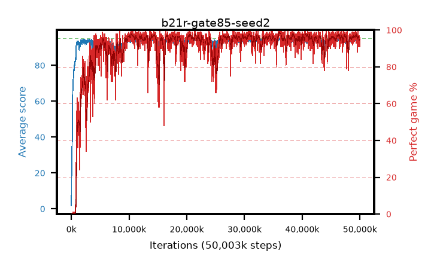

# b21r-gate85-seed2

step **50,003,968** · 3052 evals · trailing **93.83** · peak **94.7** @36,339,712 · sef **90.2** · best30 **98.3** @36,274,176

## Config

| | |
|---|---|
| algo | ppo |
| collect_envs | 128 |
| discount | 0.99 |
| eval_interval | 16384 |
| eval_queue | True |
| eval_queue_depth | 16 |
| eval_workers | 8 |
| fc_layers | (320,) |
| graph_eval_episodes | 100 |
| max_steps | 50003968 |
| min_checkpoint_score | 40.0 |
| ppo_adam_epsilon | 1e-07 |
| ppo_anneal_fraction | 1.0 |
| ppo_clip | 0.2 |
| ppo_clip_final | None |
| ppo_entropy_coef | 0.01 |
| ppo_entropy_coef_final | None |
| ppo_epochs | 4 |
| ppo_gae_lambda | 0.98 |
| ppo_gradient_clipping | 0.5 |
| ppo_horizon | 33.6 |
| ppo_learning_rate | 0.0003 |
| ppo_learning_rate_final | None |
| ppo_minibatch | 256 |
| ppo_normalize_adv | True |
| ppo_rollout | 128 |
| ppo_target_kl | 0.0 |
| ppo_transitions_per_rollout | 16384 |
| ppo_value_loss | huber |
| ppo_vf_coef | 0.5 |
| seed | 2 |
| torch_threads | 1 |

## Evals

| step | avg score | trailing avg | min score | max score | avg reward | perfect % | epsilon |
|---|---|---|---|---|---|---|---|
| 16384 | 1.73 | 1.73 | 0.0 | 5.0 | -0.874 | 0.0 |  |
| 32768 | 16.46 | 9.1 | 4.0 | 29.0 | 11.622 | 0.0 |  |
| 49152 | 21.37 | 18.29 | 4.0 | 49.0 | 16.342 | 0.0 |  |
| ... | ... | ... | ... | ... | ... | ... | ... |
| 49823744 | 93.58 | 93.87 | 30.0 | 95.0 | 187.222 | 95.0 |  |
| 49840128 | 93.41 | 93.87 | 18.0 | 95.0 | 186.151 | 94.0 |  |
| 49856512 | 94.5 | 93.91 | 74.0 | 95.0 | 189.224 | 96.0 |  |
| 49872896 | 94.38 | 93.9 | 71.0 | 95.0 | 187.101 | 94.0 |  |
| 49889280 | 94.82 | 93.81 | 89.0 | 95.0 | 189.525 | 96.0 |  |
| 49905664 | 94.66 | 93.83 | 81.0 | 95.0 | 190.37 | 97.0 |  |
| 49922048 | 94.18 | 93.85 | 70.0 | 95.0 | 187.904 | 95.0 |  |
| 49938432 | 94.37 | 93.81 | 69.0 | 95.0 | 188.094 | 95.0 |  |
| 49954816 | 94.27 | 93.86 | 64.0 | 95.0 | 185.955 | 93.0 |  |
| 49971200 | 94.4 | 93.85 | 77.0 | 95.0 | 188.115 | 95.0 |  |
| 49987584 | 94.36 | 93.86 | 72.0 | 95.0 | 189.068 | 96.0 |  |
| 50003968 | 93.23 | 93.83 | 14.0 | 95.0 | 182.96 | 91.0 |  |
