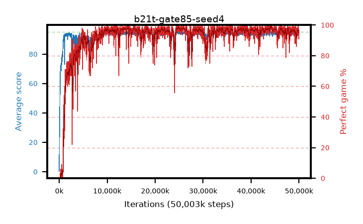

# b21t-gate85-seed4

step **50,003,968** · 3052 evals · trailing **94.2** · peak **94.71** @24,821,760 · sef **91.7** · best30 **98.5** @44,367,872

## Config

| | |
|---|---|
| algo | ppo |
| collect_envs | 128 |
| discount | 0.99 |
| eval_interval | 16384 |
| eval_queue | True |
| eval_queue_depth | 16 |
| eval_workers | 8 |
| fc_layers | (320,) |
| graph_eval_episodes | 100 |
| max_steps | 50003968 |
| min_checkpoint_score | 40.0 |
| ppo_adam_epsilon | 1e-07 |
| ppo_anneal_fraction | 1.0 |
| ppo_clip | 0.2 |
| ppo_clip_final | None |
| ppo_entropy_coef | 0.01 |
| ppo_entropy_coef_final | None |
| ppo_epochs | 4 |
| ppo_gae_lambda | 0.98 |
| ppo_gradient_clipping | 0.5 |
| ppo_horizon | 33.6 |
| ppo_learning_rate | 0.0003 |
| ppo_learning_rate_final | None |
| ppo_minibatch | 256 |
| ppo_normalize_adv | True |
| ppo_rollout | 128 |
| ppo_target_kl | 0.0 |
| ppo_transitions_per_rollout | 16384 |
| ppo_value_loss | huber |
| ppo_vf_coef | 0.5 |
| seed | 4 |
| torch_threads | 1 |

## Evals

| step | avg score | trailing avg | min score | max score | avg reward | perfect % | epsilon |
|---|---|---|---|---|---|---|---|
| 16384 | 0.27 | 0.27 | 0.0 | 3.0 | -0.639 | 0.0 |  |
| 32768 | 19.46 | 14.89 | 0.0 | 31.0 | 14.598 | 0.0 |  |
| 49152 | 24.93 | 12.6 | 5.0 | 44.0 | 19.9 | 0.0 |  |
| ... | ... | ... | ... | ... | ... | ... | ... |
| 49823744 | 93.0 | 94.06 | 6.0 | 95.0 | 187.697 | 96.0 |  |
| 49840128 | 95.0 | 94.16 | 95.0 | 95.0 | 193.691 | 100.0 |  |
| 49856512 | 93.6 | 94.17 | 8.0 | 95.0 | 186.277 | 94.0 |  |
| 49872896 | 93.85 | 94.17 | 10.0 | 95.0 | 186.532 | 94.0 |  |
| 49889280 | 93.5 | 94.19 | 12.0 | 95.0 | 188.192 | 96.0 |  |
| 49905664 | 93.77 | 94.17 | 6.0 | 95.0 | 188.485 | 96.0 |  |
| 49922048 | 94.63 | 94.17 | 68.0 | 95.0 | 190.329 | 97.0 |  |
| 49938432 | 94.67 | 94.07 | 83.0 | 95.0 | 189.313 | 96.0 |  |
| 49954816 | 94.47 | 94.22 | 79.0 | 95.0 | 184.087 | 91.0 |  |
| 49971200 | 93.64 | 94.16 | 12.0 | 95.0 | 186.313 | 94.0 |  |
| 49987584 | 94.07 | 94.24 | 30.0 | 95.0 | 187.758 | 95.0 |  |
| 50003968 | 92.58 | 94.2 | 6.0 | 95.0 | 186.241 | 95.0 |  |
