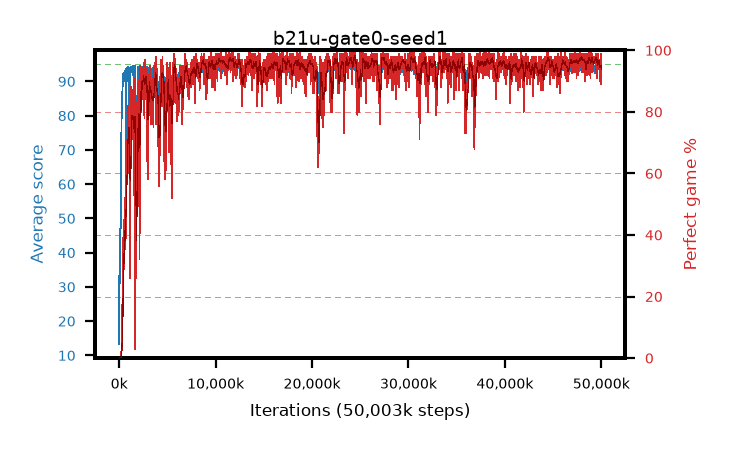

# b21u-gate0-seed1

step **50,003,968** · 3052 evals · trailing **94.24** · peak **94.49** @48,250,880 · sef **93.8** · best30 **97.3** @48,070,656

## Config

| | |
|---|---|
| algo | ppo |
| collect_envs | 128 |
| discount | 0.99 |
| eval_interval | 16384 |
| eval_queue | True |
| eval_queue_depth | 16 |
| eval_workers | 8 |
| fc_layers | (320,) |
| graph_eval_episodes | 100 |
| max_steps | 50003968 |
| min_checkpoint_score | 40.0 |
| ppo_adam_epsilon | 1e-07 |
| ppo_anneal_fraction | 1.0 |
| ppo_clip | 0.2 |
| ppo_clip_final | None |
| ppo_entropy_coef | 0.01 |
| ppo_entropy_coef_final | None |
| ppo_epochs | 4 |
| ppo_gae_lambda | 0.98 |
| ppo_gradient_clipping | 0.5 |
| ppo_horizon | 33.6 |
| ppo_learning_rate | 0.0003 |
| ppo_learning_rate_final | None |
| ppo_minibatch | 256 |
| ppo_normalize_adv | True |
| ppo_rollout | 128 |
| ppo_target_kl | 0.0 |
| ppo_transitions_per_rollout | 16384 |
| ppo_value_loss | huber |
| ppo_vf_coef | 0.5 |
| seed | 1 |
| torch_threads | 1 |

## Evals

| step | avg score | trailing avg | min score | max score | avg reward | perfect % | epsilon |
|---|---|---|---|---|---|---|---|
| 16384 | 13.29 | 30.0 | 2.0 | 38.0 | 11.577 | 0.0 |  |
| 32768 | 46.99 | 33.4 | 14.0 | 80.0 | 41.947 | 0.0 |  |
| 49152 | 39.53 | 34.42 | 14.0 | 79.0 | 34.429 | 0.0 |  |
| ... | ... | ... | ... | ... | ... | ... | ... |
| 49823744 | 94.31 | 94.36 | 72.0 | 95.0 | 186.028 | 93.0 |  |
| 49840128 | 94.73 | 94.36 | 85.0 | 95.0 | 189.394 | 96.0 |  |
| 49856512 | 93.66 | 94.43 | 61.0 | 95.0 | 182.375 | 90.0 |  |
| 49872896 | 94.33 | 94.39 | 66.0 | 95.0 | 189.008 | 96.0 |  |
| 49889280 | 94.51 | 94.43 | 76.0 | 95.0 | 189.184 | 96.0 |  |
| 49905664 | 92.59 | 94.3 | 1.0 | 95.0 | 185.316 | 94.0 |  |
| 49922048 | 93.5 | 94.38 | 5.0 | 95.0 | 184.139 | 92.0 |  |
| 49938432 | 94.2 | 94.29 | 61.0 | 95.0 | 188.859 | 96.0 |  |
| 49954816 | 94.76 | 94.29 | 86.0 | 95.0 | 190.453 | 97.0 |  |
| 49971200 | 94.11 | 94.28 | 6.0 | 95.0 | 191.803 | 99.0 |  |
| 49987584 | 93.18 | 94.26 | 3.0 | 95.0 | 180.76 | 89.0 |  |
| 50003968 | 93.74 | 94.24 | 73.0 | 95.0 | 181.315 | 89.0 |  |
