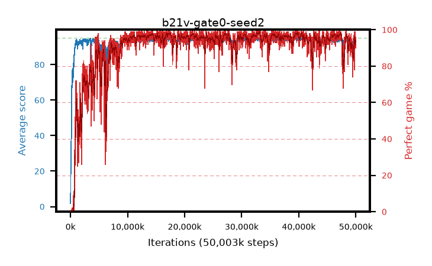

# b21v-gate0-seed2

step **50,003,968** · 3052 evals · trailing **93.64** · peak **94.59** @39,878,656 · sef **88.8** · best30 **98.3** @33,030,144

## Config

| | |
|---|---|
| algo | ppo |
| collect_envs | 128 |
| discount | 0.99 |
| eval_interval | 16384 |
| eval_queue | True |
| eval_queue_depth | 16 |
| eval_workers | 8 |
| fc_layers | (320,) |
| graph_eval_episodes | 100 |
| max_steps | 50003968 |
| min_checkpoint_score | 40.0 |
| ppo_adam_epsilon | 1e-07 |
| ppo_anneal_fraction | 1.0 |
| ppo_clip | 0.2 |
| ppo_clip_final | None |
| ppo_entropy_coef | 0.01 |
| ppo_entropy_coef_final | None |
| ppo_epochs | 4 |
| ppo_gae_lambda | 0.98 |
| ppo_gradient_clipping | 0.5 |
| ppo_horizon | 33.6 |
| ppo_learning_rate | 0.0003 |
| ppo_learning_rate_final | None |
| ppo_minibatch | 256 |
| ppo_normalize_adv | True |
| ppo_rollout | 128 |
| ppo_target_kl | 0.0 |
| ppo_transitions_per_rollout | 16384 |
| ppo_value_loss | huber |
| ppo_vf_coef | 0.5 |
| seed | 2 |
| torch_threads | 1 |

## Evals

| step | avg score | trailing avg | min score | max score | avg reward | perfect % | epsilon |
|---|---|---|---|---|---|---|---|
| 16384 | 1.8 | 1.8 | 0.0 | 7.0 | -1.161 | 0.0 |  |
| 32768 | 14.19 | 15.48 | 0.0 | 22.0 | 9.471 | 0.0 |  |
| 49152 | 21.48 | 11.64 | 4.0 | 40.0 | 16.443 | 0.0 |  |
| ... | ... | ... | ... | ... | ... | ... | ... |
| 49823744 | 94.07 | 92.82 | 64.0 | 95.0 | 188.782 | 96.0 |  |
| 49840128 | 92.69 | 92.83 | 10.0 | 95.0 | 182.337 | 91.0 |  |
| 49856512 | 93.75 | 93.13 | 16.0 | 95.0 | 188.466 | 96.0 |  |
| 49872896 | 94.72 | 93.08 | 67.0 | 95.0 | 192.427 | 99.0 |  |
| 49889280 | 94.37 | 93.0 | 61.0 | 95.0 | 187.994 | 95.0 |  |
| 49905664 | 93.82 | 93.02 | 64.0 | 95.0 | 184.542 | 92.0 |  |
| 49922048 | 93.3 | 93.28 | 6.0 | 95.0 | 186.97 | 95.0 |  |
| 49938432 | 93.71 | 93.19 | 63.0 | 95.0 | 185.433 | 93.0 |  |
| 49954816 | 93.34 | 93.26 | 4.0 | 95.0 | 186.052 | 94.0 |  |
| 49971200 | 94.12 | 93.48 | 68.0 | 95.0 | 185.841 | 93.0 |  |
| 49987584 | 94.1 | 93.59 | 70.0 | 95.0 | 188.816 | 96.0 |  |
| 50003968 | 93.64 | 93.64 | 71.0 | 95.0 | 182.36 | 90.0 |  |
