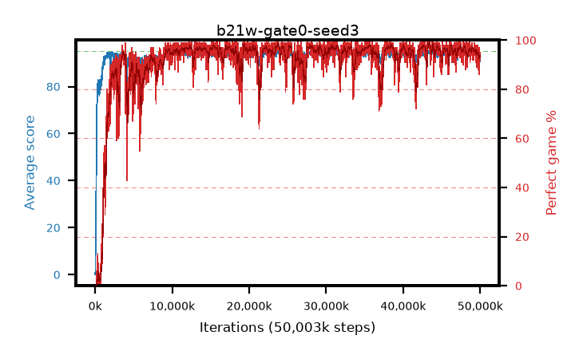

# b21w-gate0-seed3

step **50,003,968** · 3052 evals · trailing **93.63** · peak **94.57** @43,827,200 · sef **93.1** · best30 **97.9** @23,871,488

## Config

| | |
|---|---|
| algo | ppo |
| collect_envs | 128 |
| discount | 0.99 |
| eval_interval | 16384 |
| eval_queue | True |
| eval_queue_depth | 16 |
| eval_workers | 8 |
| fc_layers | (320,) |
| graph_eval_episodes | 100 |
| max_steps | 50003968 |
| min_checkpoint_score | 40.0 |
| ppo_adam_epsilon | 1e-07 |
| ppo_anneal_fraction | 1.0 |
| ppo_clip | 0.2 |
| ppo_clip_final | None |
| ppo_entropy_coef | 0.01 |
| ppo_entropy_coef_final | None |
| ppo_epochs | 4 |
| ppo_gae_lambda | 0.98 |
| ppo_gradient_clipping | 0.5 |
| ppo_horizon | 33.6 |
| ppo_learning_rate | 0.0003 |
| ppo_learning_rate_final | None |
| ppo_minibatch | 256 |
| ppo_normalize_adv | True |
| ppo_rollout | 128 |
| ppo_target_kl | 0.0 |
| ppo_transitions_per_rollout | 16384 |
| ppo_value_loss | huber |
| ppo_vf_coef | 0.5 |
| seed | 3 |
| torch_threads | 1 |

## Evals

| step | avg score | trailing avg | min score | max score | avg reward | perfect % | epsilon |
|---|---|---|---|---|---|---|---|
| 16384 | 0.06 | 0.06 | 0.0 | 1.0 | -2.732 | 0.0 |  |
| 32768 | 1.54 | 0.8 | 0.0 | 5.0 | 0.936 | 0.0 |  |
| 49152 | 13.04 | 9.05 | 0.0 | 35.0 | 9.188 | 0.0 |  |
| ... | ... | ... | ... | ... | ... | ... | ... |
| 49823744 | 92.81 | 93.92 | 36.0 | 95.0 | 177.522 | 86.0 |  |
| 49840128 | 93.14 | 93.99 | 4.0 | 95.0 | 185.805 | 94.0 |  |
| 49856512 | 93.13 | 94.0 | 10.0 | 95.0 | 179.792 | 88.0 |  |
| 49872896 | 94.22 | 94.04 | 38.0 | 95.0 | 189.921 | 97.0 |  |
| 49889280 | 93.74 | 93.85 | 8.0 | 95.0 | 187.46 | 95.0 |  |
| 49905664 | 94.77 | 93.89 | 87.0 | 95.0 | 189.468 | 96.0 |  |
| 49922048 | 93.86 | 93.98 | 26.0 | 95.0 | 187.579 | 95.0 |  |
| 49938432 | 90.57 | 93.85 | 8.0 | 95.0 | 181.278 | 92.0 |  |
| 49954816 | 92.36 | 93.86 | 12.0 | 95.0 | 185.085 | 94.0 |  |
| 49971200 | 92.78 | 93.78 | 8.0 | 95.0 | 186.498 | 95.0 |  |
| 49987584 | 92.37 | 93.71 | 9.0 | 95.0 | 183.068 | 92.0 |  |
| 50003968 | 92.49 | 93.63 | 12.0 | 95.0 | 184.217 | 93.0 |  |
