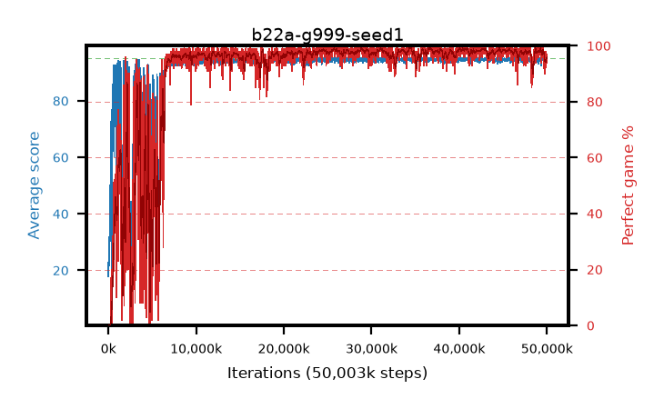

# b22a-g999-seed1

step **50,003,968** · 3052 evals · trailing **94.35** · peak **94.87** @40,992,768 · sef **89.4** · best30 **98.9** @36,798,464

## Config

| | |
|---|---|
| algo | ppo |
| collect_envs | 128 |
| discount | 0.999 |
| eval_interval | 16384 |
| eval_queue | True |
| eval_queue_depth | 16 |
| eval_workers | 8 |
| fc_layers | (320,) |
| graph_eval_episodes | 100 |
| max_steps | 50003968 |
| min_checkpoint_score | 40.0 |
| ppo_adam_epsilon | 1e-07 |
| ppo_anneal_fraction | 1.0 |
| ppo_clip | 0.2 |
| ppo_clip_final | None |
| ppo_entropy_coef | 0.01 |
| ppo_entropy_coef_final | None |
| ppo_epochs | 4 |
| ppo_gae_lambda | 0.99 |
| ppo_gradient_clipping | 0.5 |
| ppo_horizon | 91.0 |
| ppo_learning_rate | 0.0003 |
| ppo_learning_rate_final | None |
| ppo_minibatch | 256 |
| ppo_normalize_adv | True |
| ppo_rollout | 128 |
| ppo_target_kl | 0.0 |
| ppo_transitions_per_rollout | 16384 |
| ppo_value_loss | huber |
| ppo_vf_coef | 0.5 |
| seed | 1 |
| torch_threads | 1 |

## Evals

| step | avg score | trailing avg | min score | max score | avg reward | perfect % | epsilon |
|---|---|---|---|---|---|---|---|
| 16384 | 17.99 | 17.99 | 3.0 | 35.0 | 12.939 | 0.0 |  |
| 32768 | 26.08 | 22.03 | 6.0 | 53.0 | 21.096 | 0.0 |  |
| 49152 | 22.8 | 22.29 | 5.0 | 39.0 | 17.826 | 0.0 |  |
| ... | ... | ... | ... | ... | ... | ... | ... |
| 49823744 | 93.76 | 94.41 | 58.0 | 95.0 | 184.429 | 92.0 |  |
| 49840128 | 94.07 | 94.46 | 22.0 | 95.0 | 190.732 | 98.0 |  |
| 49856512 | 94.6 | 94.46 | 74.0 | 95.0 | 191.32 | 98.0 |  |
| 49872896 | 94.19 | 94.46 | 68.0 | 95.0 | 187.888 | 95.0 |  |
| 49889280 | 94.49 | 94.46 | 68.0 | 95.0 | 187.056 | 94.0 |  |
| 49905664 | 94.27 | 94.45 | 68.0 | 95.0 | 187.969 | 95.0 |  |
| 49922048 | 94.0 | 94.32 | 65.0 | 95.0 | 186.709 | 94.0 |  |
| 49938432 | 93.98 | 94.39 | 67.0 | 95.0 | 188.641 | 96.0 |  |
| 49954816 | 94.42 | 94.32 | 73.0 | 95.0 | 189.121 | 96.0 |  |
| 49971200 | 94.61 | 94.32 | 70.0 | 95.0 | 189.312 | 96.0 |  |
| 49987584 | 94.0 | 94.37 | 40.0 | 95.0 | 189.659 | 97.0 |  |
| 50003968 | 94.04 | 94.35 | 67.0 | 95.0 | 186.709 | 94.0 |  |
