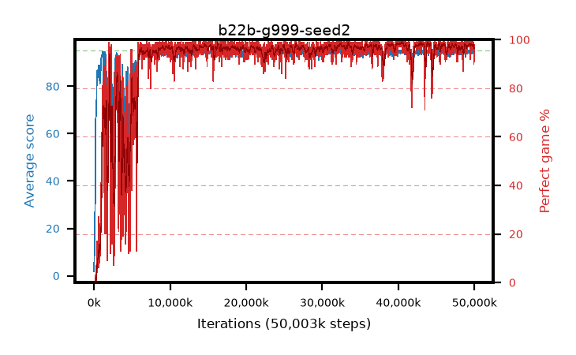

# b22b-g999-seed2

step **50,003,968** · 3052 evals · trailing **94.55** · peak **94.68** @40,681,472 · sef **90.9** · best30 **98.7** @40,501,248

## Config

| | |
|---|---|
| algo | ppo |
| collect_envs | 128 |
| discount | 0.999 |
| eval_interval | 16384 |
| eval_queue | True |
| eval_queue_depth | 16 |
| eval_workers | 8 |
| fc_layers | (320,) |
| graph_eval_episodes | 100 |
| max_steps | 50003968 |
| min_checkpoint_score | 40.0 |
| ppo_adam_epsilon | 1e-07 |
| ppo_anneal_fraction | 1.0 |
| ppo_clip | 0.2 |
| ppo_clip_final | None |
| ppo_entropy_coef | 0.01 |
| ppo_entropy_coef_final | None |
| ppo_epochs | 4 |
| ppo_gae_lambda | 0.99 |
| ppo_gradient_clipping | 0.5 |
| ppo_horizon | 91.0 |
| ppo_learning_rate | 0.0003 |
| ppo_learning_rate_final | None |
| ppo_minibatch | 256 |
| ppo_normalize_adv | True |
| ppo_rollout | 128 |
| ppo_target_kl | 0.0 |
| ppo_transitions_per_rollout | 16384 |
| ppo_value_loss | huber |
| ppo_vf_coef | 0.5 |
| seed | 2 |
| torch_threads | 1 |

## Evals

| step | avg score | trailing avg | min score | max score | avg reward | perfect % | epsilon |
|---|---|---|---|---|---|---|---|
| 16384 | 1.81 | 1.81 | 0.0 | 8.0 | -1.91 | 0.0 |  |
| 32768 | 7.97 | 4.89 | 2.0 | 18.0 | 2.962 | 0.0 |  |
| 49152 | 8.44 | 6.07 | 2.0 | 20.0 | 3.433 | 0.0 |  |
| ... | ... | ... | ... | ... | ... | ... | ... |
| 49823744 | 94.98 | 94.56 | 93.0 | 95.0 | 192.689 | 99.0 |  |
| 49840128 | 94.74 | 94.57 | 71.0 | 95.0 | 191.457 | 98.0 |  |
| 49856512 | 94.47 | 94.56 | 71.0 | 95.0 | 189.197 | 96.0 |  |
| 49872896 | 94.06 | 94.53 | 65.0 | 95.0 | 188.744 | 96.0 |  |
| 49889280 | 94.7 | 94.56 | 65.0 | 95.0 | 192.416 | 99.0 |  |
| 49905664 | 94.89 | 94.52 | 89.0 | 95.0 | 191.584 | 98.0 |  |
| 49922048 | 93.72 | 94.52 | 78.0 | 95.0 | 182.437 | 90.0 |  |
| 49938432 | 94.35 | 94.56 | 73.0 | 95.0 | 188.051 | 95.0 |  |
| 49954816 | 94.31 | 94.55 | 30.0 | 95.0 | 190.954 | 98.0 |  |
| 49971200 | 94.15 | 94.55 | 32.0 | 95.0 | 189.844 | 97.0 |  |
| 49987584 | 94.5 | 94.53 | 67.0 | 95.0 | 190.213 | 97.0 |  |
| 50003968 | 94.68 | 94.55 | 75.0 | 95.0 | 191.392 | 98.0 |  |
