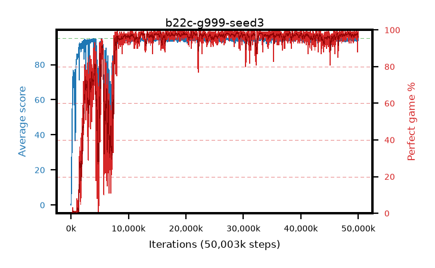

# b22c-g999-seed3

step **50,003,968** · 3052 evals · trailing **94.3** · peak **94.67** @27,344,896 · sef **87.0** · best30 **98.3** @29,065,216

## Config

| | |
|---|---|
| algo | ppo |
| collect_envs | 128 |
| discount | 0.999 |
| eval_interval | 16384 |
| eval_queue | True |
| eval_queue_depth | 16 |
| eval_workers | 8 |
| fc_layers | (320,) |
| graph_eval_episodes | 100 |
| max_steps | 50003968 |
| min_checkpoint_score | 40.0 |
| ppo_adam_epsilon | 1e-07 |
| ppo_anneal_fraction | 1.0 |
| ppo_clip | 0.2 |
| ppo_clip_final | None |
| ppo_entropy_coef | 0.01 |
| ppo_entropy_coef_final | None |
| ppo_epochs | 4 |
| ppo_gae_lambda | 0.99 |
| ppo_gradient_clipping | 0.5 |
| ppo_horizon | 91.0 |
| ppo_learning_rate | 0.0003 |
| ppo_learning_rate_final | None |
| ppo_minibatch | 256 |
| ppo_normalize_adv | True |
| ppo_rollout | 128 |
| ppo_target_kl | 0.0 |
| ppo_transitions_per_rollout | 16384 |
| ppo_value_loss | huber |
| ppo_vf_coef | 0.5 |
| seed | 3 |
| torch_threads | 1 |

## Evals

| step | avg score | trailing avg | min score | max score | avg reward | perfect % | epsilon |
|---|---|---|---|---|---|---|---|
| 16384 | 0.06 | 0.06 | 0.0 | 1.0 | -4.587 | 0.0 |  |
| 32768 | 0.83 | 0.44 | 0.0 | 5.0 | 0.276 | 0.0 |  |
| 49152 | 11.62 | 7.53 | 0.0 | 24.0 | 7.034 | 0.0 |  |
| ... | ... | ... | ... | ... | ... | ... | ... |
| 49823744 | 94.52 | 94.45 | 57.0 | 95.0 | 191.259 | 98.0 |  |
| 49840128 | 94.11 | 94.41 | 12.0 | 95.0 | 190.852 | 98.0 |  |
| 49856512 | 94.96 | 94.5 | 91.0 | 95.0 | 192.696 | 99.0 |  |
| 49872896 | 93.08 | 94.43 | 6.0 | 95.0 | 188.771 | 97.0 |  |
| 49889280 | 93.63 | 94.42 | 30.0 | 95.0 | 187.363 | 95.0 |  |
| 49905664 | 91.57 | 94.28 | 31.0 | 95.0 | 178.239 | 88.0 |  |
| 49922048 | 94.57 | 94.38 | 63.0 | 95.0 | 190.292 | 97.0 |  |
| 49938432 | 94.21 | 94.39 | 62.0 | 95.0 | 189.938 | 97.0 |  |
| 49954816 | 93.84 | 94.39 | 16.0 | 95.0 | 189.581 | 97.0 |  |
| 49971200 | 93.95 | 94.37 | 58.0 | 95.0 | 188.68 | 96.0 |  |
| 49987584 | 94.88 | 94.29 | 83.0 | 95.0 | 192.615 | 99.0 |  |
| 50003968 | 94.84 | 94.3 | 79.0 | 95.0 | 192.57 | 99.0 |  |
