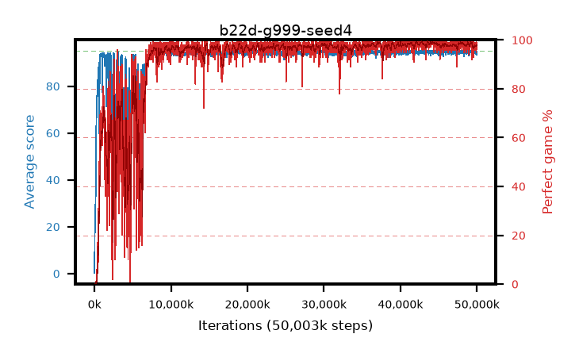

# b22d-g999-seed4

step **50,003,968** · 3052 evals · trailing **94.42** · peak **94.76** @37,388,288 · sef **89.0** · best30 **98.9** @43,892,736

## Config

| | |
|---|---|
| algo | ppo |
| collect_envs | 128 |
| discount | 0.999 |
| eval_interval | 16384 |
| eval_queue | True |
| eval_queue_depth | 16 |
| eval_workers | 8 |
| fc_layers | (320,) |
| graph_eval_episodes | 100 |
| max_steps | 50003968 |
| min_checkpoint_score | 40.0 |
| ppo_adam_epsilon | 1e-07 |
| ppo_anneal_fraction | 1.0 |
| ppo_clip | 0.2 |
| ppo_clip_final | None |
| ppo_entropy_coef | 0.01 |
| ppo_entropy_coef_final | None |
| ppo_epochs | 4 |
| ppo_gae_lambda | 0.99 |
| ppo_gradient_clipping | 0.5 |
| ppo_horizon | 91.0 |
| ppo_learning_rate | 0.0003 |
| ppo_learning_rate_final | None |
| ppo_minibatch | 256 |
| ppo_normalize_adv | True |
| ppo_rollout | 128 |
| ppo_target_kl | 0.0 |
| ppo_transitions_per_rollout | 16384 |
| ppo_value_loss | huber |
| ppo_vf_coef | 0.5 |
| seed | 4 |
| torch_threads | 1 |

## Evals

| step | avg score | trailing avg | min score | max score | avg reward | perfect % | epsilon |
|---|---|---|---|---|---|---|---|
| 16384 | 0.26 | 0.26 | 0.0 | 2.0 | -0.467 | 0.0 |  |
| 32768 | 15.2 | 7.73 | 5.0 | 28.0 | 10.19 | 0.0 |  |
| 49152 | 19.43 | 14.5 | 8.0 | 36.0 | 14.422 | 0.0 |  |
| ... | ... | ... | ... | ... | ... | ... | ... |
| 49823744 | 93.85 | 94.36 | 39.0 | 95.0 | 188.55 | 96.0 |  |
| 49840128 | 94.95 | 94.37 | 90.0 | 95.0 | 192.667 | 99.0 |  |
| 49856512 | 93.82 | 94.32 | 8.0 | 95.0 | 189.475 | 97.0 |  |
| 49872896 | 94.13 | 94.31 | 8.0 | 95.0 | 191.866 | 99.0 |  |
| 49889280 | 94.63 | 94.34 | 58.0 | 95.0 | 192.368 | 99.0 |  |
| 49905664 | 94.25 | 94.38 | 20.0 | 95.0 | 191.97 | 99.0 |  |
| 49922048 | 94.42 | 94.37 | 67.0 | 95.0 | 188.154 | 95.0 |  |
| 49938432 | 94.63 | 94.38 | 58.0 | 95.0 | 192.345 | 99.0 |  |
| 49954816 | 94.52 | 94.39 | 59.0 | 95.0 | 191.241 | 98.0 |  |
| 49971200 | 93.27 | 94.36 | 14.0 | 95.0 | 187.947 | 96.0 |  |
| 49987584 | 94.93 | 94.39 | 88.0 | 95.0 | 192.656 | 99.0 |  |
| 50003968 | 94.89 | 94.42 | 86.0 | 95.0 | 191.612 | 98.0 |  |
