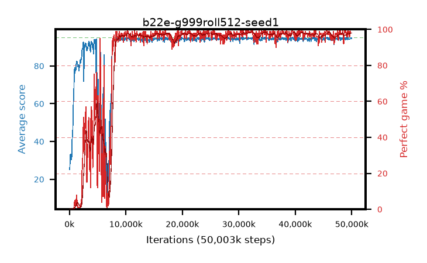

# b22e-g999roll512-seed1

step **50,003,968** · 763 evals · trailing **94.35** · peak **94.53** @32,178,176 · sef **85.3** · best30 **98.3** @32,505,856

## Config

| | |
|---|---|
| algo | ppo |
| collect_envs | 128 |
| discount | 0.999 |
| eval_interval | 65536 |
| eval_queue | True |
| eval_queue_depth | 16 |
| eval_workers | 8 |
| fc_layers | (320,) |
| graph_eval_episodes | 100 |
| max_steps | 50003968 |
| min_checkpoint_score | 40.0 |
| ppo_adam_epsilon | 1e-07 |
| ppo_anneal_fraction | 1.0 |
| ppo_clip | 0.2 |
| ppo_clip_final | None |
| ppo_entropy_coef | 0.01 |
| ppo_entropy_coef_final | None |
| ppo_epochs | 4 |
| ppo_gae_lambda | 0.99 |
| ppo_gradient_clipping | 0.5 |
| ppo_horizon | 91.0 |
| ppo_learning_rate | 0.0003 |
| ppo_learning_rate_final | None |
| ppo_minibatch | 256 |
| ppo_normalize_adv | True |
| ppo_rollout | 512 |
| ppo_target_kl | 0.0 |
| ppo_transitions_per_rollout | 65536 |
| ppo_value_loss | huber |
| ppo_vf_coef | 0.5 |
| seed | 1 |
| torch_threads | 1 |

## Evals

| step | avg score | trailing avg | min score | max score | avg reward | perfect % | epsilon |
|---|---|---|---|---|---|---|---|
| 65536 | 25.13 | 25.13 | 3.0 | 55.0 | 20.417 | 0.0 |  |
| 131072 | 32.33 | 28.73 | 9.0 | 60.0 | 27.297 | 0.0 |  |
| 196608 | 33.31 | 30.26 | 3.0 | 63.0 | 28.339 | 0.0 |  |
| ... | ... | ... | ... | ... | ... | ... | ... |
| 49283072 | 93.94 | 94.31 | 63.0 | 95.0 | 188.684 | 96.0 |  |
| 49348608 | 95.0 | 94.33 | 95.0 | 95.0 | 193.732 | 100.0 |  |
| 49414144 | 94.15 | 94.34 | 10.0 | 95.0 | 191.847 | 99.0 |  |
| 49479680 | 94.33 | 94.32 | 52.0 | 95.0 | 189.946 | 97.0 |  |
| 49545216 | 94.28 | 94.33 | 57.0 | 95.0 | 189.979 | 97.0 |  |
| 49610752 | 94.2 | 94.36 | 63.0 | 95.0 | 188.861 | 96.0 |  |
| 49676288 | 94.15 | 94.34 | 10.0 | 95.0 | 191.885 | 99.0 |  |
| 49741824 | 94.93 | 94.36 | 88.0 | 95.0 | 192.66 | 99.0 |  |
| 49807360 | 94.72 | 94.35 | 72.0 | 95.0 | 191.467 | 98.0 |  |
| 49872896 | 94.78 | 94.36 | 79.0 | 95.0 | 191.516 | 98.0 |  |
| 49938432 | 94.41 | 94.38 | 58.0 | 95.0 | 191.146 | 98.0 |  |
| 50003968 | 94.62 | 94.35 | 67.0 | 95.0 | 191.354 | 98.0 |  |
