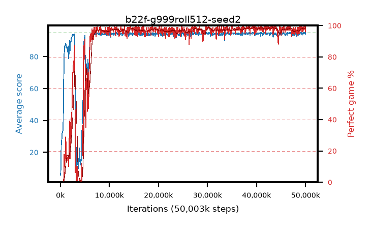

# b22f-g999roll512-seed2

step **50,003,968** · 763 evals · trailing **94.43** · peak **94.58** @39,583,744 · sef **89.1** · best30 **98.4** @39,780,352

## Config

| | |
|---|---|
| algo | ppo |
| collect_envs | 128 |
| discount | 0.999 |
| eval_interval | 65536 |
| eval_queue | True |
| eval_queue_depth | 16 |
| eval_workers | 8 |
| fc_layers | (320,) |
| graph_eval_episodes | 100 |
| max_steps | 50003968 |
| min_checkpoint_score | 40.0 |
| ppo_adam_epsilon | 1e-07 |
| ppo_anneal_fraction | 1.0 |
| ppo_clip | 0.2 |
| ppo_clip_final | None |
| ppo_entropy_coef | 0.01 |
| ppo_entropy_coef_final | None |
| ppo_epochs | 4 |
| ppo_gae_lambda | 0.99 |
| ppo_gradient_clipping | 0.5 |
| ppo_horizon | 91.0 |
| ppo_learning_rate | 0.0003 |
| ppo_learning_rate_final | None |
| ppo_minibatch | 256 |
| ppo_normalize_adv | True |
| ppo_rollout | 512 |
| ppo_target_kl | 0.0 |
| ppo_transitions_per_rollout | 65536 |
| ppo_value_loss | huber |
| ppo_vf_coef | 0.5 |
| seed | 2 |
| torch_threads | 1 |

## Evals

| step | avg score | trailing avg | min score | max score | avg reward | perfect % | epsilon |
|---|---|---|---|---|---|---|---|
| 65536 | 5.68 | 5.68 | 2.0 | 14.0 | 0.703 | 0.0 |  |
| 131072 | 13.12 | 9.4 | 4.0 | 25.0 | 8.266 | 0.0 |  |
| 196608 | 24.57 | 14.46 | 3.0 | 44.0 | 19.536 | 0.0 |  |
| ... | ... | ... | ... | ... | ... | ... | ... |
| 49283072 | 93.59 | 94.22 | 18.0 | 95.0 | 188.299 | 96.0 |  |
| 49348608 | 94.57 | 94.27 | 74.0 | 95.0 | 190.313 | 97.0 |  |
| 49414144 | 94.67 | 94.27 | 62.0 | 95.0 | 192.406 | 99.0 |  |
| 49479680 | 94.11 | 94.28 | 57.0 | 95.0 | 188.805 | 96.0 |  |
| 49545216 | 94.44 | 94.29 | 58.0 | 95.0 | 191.175 | 98.0 |  |
| 49610752 | 94.63 | 94.33 | 58.0 | 95.0 | 192.364 | 99.0 |  |
| 49676288 | 95.0 | 94.37 | 95.0 | 95.0 | 193.727 | 100.0 |  |
| 49741824 | 94.78 | 94.38 | 73.0 | 95.0 | 192.507 | 99.0 |  |
| 49807360 | 95.0 | 94.41 | 95.0 | 95.0 | 193.737 | 100.0 |  |
| 49872896 | 94.96 | 94.39 | 91.0 | 95.0 | 192.685 | 99.0 |  |
| 49938432 | 93.96 | 94.39 | 8.0 | 95.0 | 188.694 | 96.0 |  |
| 50003968 | 95.0 | 94.43 | 95.0 | 95.0 | 193.732 | 100.0 |  |
