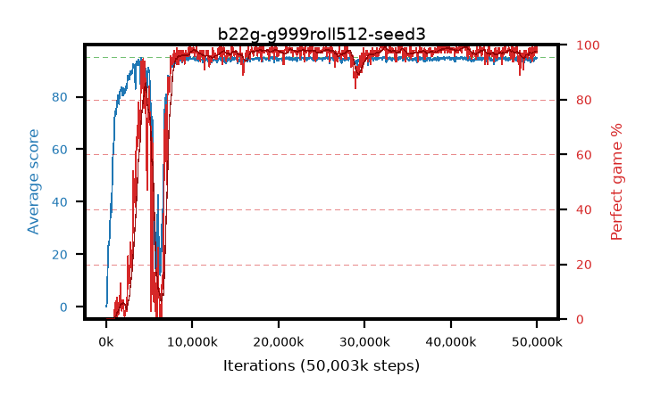

# b22g-g999roll512-seed3

step **50,003,968** · 763 evals · trailing **94.15** · peak **94.63** @41,091,072 · sef **86.9** · best30 **98.6** @40,370,176

## Config

| | |
|---|---|
| algo | ppo |
| collect_envs | 128 |
| discount | 0.999 |
| eval_interval | 65536 |
| eval_queue | True |
| eval_queue_depth | 16 |
| eval_workers | 8 |
| fc_layers | (320,) |
| graph_eval_episodes | 100 |
| max_steps | 50003968 |
| min_checkpoint_score | 40.0 |
| ppo_adam_epsilon | 1e-07 |
| ppo_anneal_fraction | 1.0 |
| ppo_clip | 0.2 |
| ppo_clip_final | None |
| ppo_entropy_coef | 0.01 |
| ppo_entropy_coef_final | None |
| ppo_epochs | 4 |
| ppo_gae_lambda | 0.99 |
| ppo_gradient_clipping | 0.5 |
| ppo_horizon | 91.0 |
| ppo_learning_rate | 0.0003 |
| ppo_learning_rate_final | None |
| ppo_minibatch | 256 |
| ppo_normalize_adv | True |
| ppo_rollout | 512 |
| ppo_target_kl | 0.0 |
| ppo_transitions_per_rollout | 65536 |
| ppo_value_loss | huber |
| ppo_vf_coef | 0.5 |
| seed | 3 |
| torch_threads | 1 |

## Evals

| step | avg score | trailing avg | min score | max score | avg reward | perfect % | epsilon |
|---|---|---|---|---|---|---|---|
| 65536 | 0.09 | 0.09 | 0.0 | 2.0 | -4.379 | 0.0 |  |
| 131072 | 2.91 | 1.5 | 0.0 | 10.0 | 0.867 | 0.0 |  |
| 196608 | 14.85 | 5.95 | 1.0 | 27.0 | 10.191 | 0.0 |  |
| ... | ... | ... | ... | ... | ... | ... | ... |
| 49283072 | 94.78 | 94.15 | 73.0 | 95.0 | 192.511 | 99.0 |  |
| 49348608 | 94.07 | 94.11 | 24.0 | 95.0 | 190.802 | 98.0 |  |
| 49414144 | 93.9 | 94.08 | 61.0 | 95.0 | 186.605 | 94.0 |  |
| 49479680 | 95.0 | 94.1 | 95.0 | 95.0 | 193.729 | 100.0 |  |
| 49545216 | 93.99 | 94.05 | 16.0 | 95.0 | 190.719 | 98.0 |  |
| 49610752 | 93.41 | 94.08 | 10.0 | 95.0 | 188.114 | 96.0 |  |
| 49676288 | 94.18 | 94.03 | 61.0 | 95.0 | 189.911 | 97.0 |  |
| 49741824 | 94.85 | 94.05 | 80.0 | 95.0 | 192.57 | 99.0 |  |
| 49807360 | 95.0 | 94.07 | 95.0 | 95.0 | 193.735 | 100.0 |  |
| 49872896 | 94.52 | 94.13 | 65.0 | 95.0 | 190.249 | 97.0 |  |
| 49938432 | 94.6 | 94.19 | 65.0 | 95.0 | 190.324 | 97.0 |  |
| 50003968 | 94.63 | 94.15 | 58.0 | 95.0 | 192.361 | 99.0 |  |
