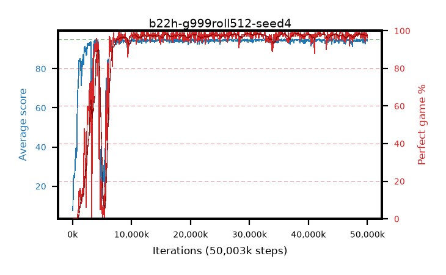

# b22h-g999roll512-seed4

step **50,003,968** · 763 evals · trailing **94.31** · peak **94.62** @32,636,928 · sef **89.8** · best30 **98.1** @30,998,528

## Config

| | |
|---|---|
| algo | ppo |
| collect_envs | 128 |
| discount | 0.999 |
| eval_interval | 65536 |
| eval_queue | True |
| eval_queue_depth | 16 |
| eval_workers | 8 |
| fc_layers | (320,) |
| graph_eval_episodes | 100 |
| max_steps | 50003968 |
| min_checkpoint_score | 40.0 |
| ppo_adam_epsilon | 1e-07 |
| ppo_anneal_fraction | 1.0 |
| ppo_clip | 0.2 |
| ppo_clip_final | None |
| ppo_entropy_coef | 0.01 |
| ppo_entropy_coef_final | None |
| ppo_epochs | 4 |
| ppo_gae_lambda | 0.99 |
| ppo_gradient_clipping | 0.5 |
| ppo_horizon | 91.0 |
| ppo_learning_rate | 0.0003 |
| ppo_learning_rate_final | None |
| ppo_minibatch | 256 |
| ppo_normalize_adv | True |
| ppo_rollout | 512 |
| ppo_target_kl | 0.0 |
| ppo_transitions_per_rollout | 65536 |
| ppo_value_loss | huber |
| ppo_vf_coef | 0.5 |
| seed | 4 |
| torch_threads | 1 |

## Evals

| step | avg score | trailing avg | min score | max score | avg reward | perfect % | epsilon |
|---|---|---|---|---|---|---|---|
| 65536 | 7.68 | 7.68 | 0.0 | 24.0 | 2.671 | 0.0 |  |
| 131072 | 21.07 | 14.38 | 5.0 | 39.0 | 16.048 | 0.0 |  |
| 196608 | 24.6 | 17.78 | 2.0 | 39.0 | 19.578 | 0.0 |  |
| ... | ... | ... | ... | ... | ... | ... | ... |
| 49283072 | 94.94 | 94.21 | 89.0 | 95.0 | 192.667 | 99.0 |  |
| 49348608 | 93.66 | 94.21 | 10.0 | 95.0 | 189.394 | 97.0 |  |
| 49414144 | 95.0 | 94.33 | 95.0 | 95.0 | 193.722 | 100.0 |  |
| 49479680 | 93.13 | 94.29 | 10.0 | 95.0 | 187.871 | 96.0 |  |
| 49545216 | 94.51 | 94.31 | 73.0 | 95.0 | 190.241 | 97.0 |  |
| 49610752 | 92.68 | 94.27 | 8.0 | 95.0 | 185.437 | 94.0 |  |
| 49676288 | 94.71 | 94.31 | 66.0 | 95.0 | 192.446 | 99.0 |  |
| 49741824 | 94.64 | 94.27 | 68.0 | 95.0 | 191.376 | 98.0 |  |
| 49807360 | 94.69 | 94.29 | 64.0 | 95.0 | 192.42 | 99.0 |  |
| 49872896 | 94.65 | 94.33 | 72.0 | 95.0 | 191.384 | 98.0 |  |
| 49938432 | 94.09 | 94.33 | 58.0 | 95.0 | 188.828 | 96.0 |  |
| 50003968 | 94.8 | 94.31 | 84.0 | 95.0 | 191.538 | 98.0 |  |
