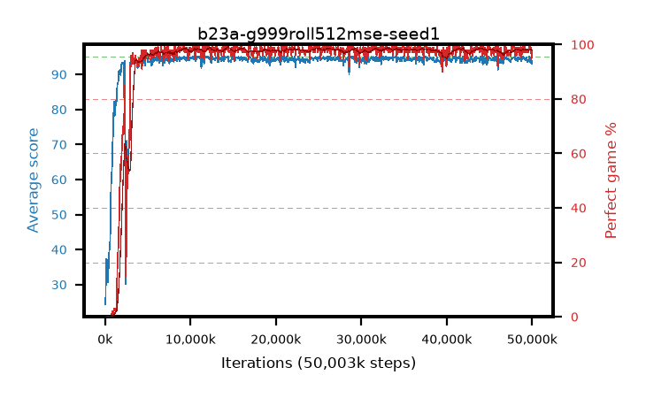

# b23a-g999roll512mse-seed1

step **50,003,968** · 763 evals · trailing **94.33** · peak **94.62** @11,010,048 · sef **94.4** · best30 **98.4** @25,952,256

## Config

| | |
|---|---|
| algo | ppo |
| collect_envs | 128 |
| discount | 0.999 |
| eval_interval | 65536 |
| eval_queue | True |
| eval_queue_depth | 16 |
| eval_workers | 8 |
| fc_layers | (320,) |
| graph_eval_episodes | 100 |
| max_steps | 50003968 |
| min_checkpoint_score | 40.0 |
| ppo_adam_epsilon | 1e-07 |
| ppo_anneal_fraction | 1.0 |
| ppo_clip | 0.2 |
| ppo_clip_final | None |
| ppo_entropy_coef | 0.01 |
| ppo_entropy_coef_final | None |
| ppo_epochs | 4 |
| ppo_gae_lambda | 0.99 |
| ppo_gradient_clipping | 0.5 |
| ppo_horizon | 91.0 |
| ppo_learning_rate | 0.0003 |
| ppo_learning_rate_final | None |
| ppo_minibatch | 256 |
| ppo_normalize_adv | True |
| ppo_rollout | 512 |
| ppo_target_kl | 0.0 |
| ppo_transitions_per_rollout | 65536 |
| ppo_value_loss | mse |
| ppo_vf_coef | 0.5 |
| seed | 1 |
| torch_threads | 1 |

## Evals

| step | avg score | trailing avg | min score | max score | avg reward | perfect % | epsilon |
|---|---|---|---|---|---|---|---|
| 65536 | 24.35 | 24.35 | 2.0 | 41.0 | 19.482 | 0.0 |  |
| 131072 | 37.3 | 30.82 | 16.0 | 66.0 | 32.202 | 0.0 |  |
| 196608 | 37.12 | 32.84 | 8.0 | 62.0 | 32.039 | 0.0 |  |
| ... | ... | ... | ... | ... | ... | ... | ... |
| 49283072 | 94.42 | 94.45 | 62.0 | 95.0 | 191.155 | 98.0 |  |
| 49348608 | 94.76 | 94.48 | 74.0 | 95.0 | 191.486 | 98.0 |  |
| 49414144 | 93.87 | 94.44 | 16.0 | 95.0 | 190.601 | 98.0 |  |
| 49479680 | 93.45 | 94.47 | 16.0 | 95.0 | 189.148 | 97.0 |  |
| 49545216 | 94.14 | 94.45 | 57.0 | 95.0 | 189.865 | 97.0 |  |
| 49610752 | 94.3 | 94.44 | 58.0 | 95.0 | 191.036 | 98.0 |  |
| 49676288 | 95.0 | 94.46 | 95.0 | 95.0 | 193.733 | 100.0 |  |
| 49741824 | 94.97 | 94.47 | 92.0 | 95.0 | 192.703 | 99.0 |  |
| 49807360 | 93.4 | 94.42 | 14.0 | 95.0 | 190.108 | 98.0 |  |
| 49872896 | 94.37 | 94.41 | 32.0 | 95.0 | 192.1 | 99.0 |  |
| 49938432 | 93.01 | 94.34 | 10.0 | 95.0 | 186.756 | 95.0 |  |
| 50003968 | 93.85 | 94.33 | 10.0 | 95.0 | 190.59 | 98.0 |  |
