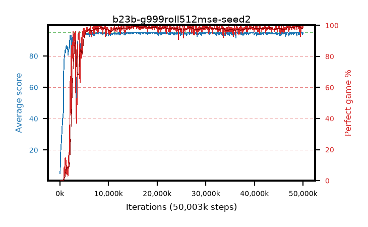

# b23b-g999roll512mse-seed2

step **50,003,968** · 763 evals · trailing **94.62** · peak **94.75** @15,859,712 · sef **93.8** · best30 **99.1** @15,859,712

## Config

| | |
|---|---|
| algo | ppo |
| collect_envs | 128 |
| discount | 0.999 |
| eval_interval | 65536 |
| eval_queue | True |
| eval_queue_depth | 16 |
| eval_workers | 8 |
| fc_layers | (320,) |
| graph_eval_episodes | 100 |
| max_steps | 50003968 |
| min_checkpoint_score | 40.0 |
| ppo_adam_epsilon | 1e-07 |
| ppo_anneal_fraction | 1.0 |
| ppo_clip | 0.2 |
| ppo_clip_final | None |
| ppo_entropy_coef | 0.01 |
| ppo_entropy_coef_final | None |
| ppo_epochs | 4 |
| ppo_gae_lambda | 0.99 |
| ppo_gradient_clipping | 0.5 |
| ppo_horizon | 91.0 |
| ppo_learning_rate | 0.0003 |
| ppo_learning_rate_final | None |
| ppo_minibatch | 256 |
| ppo_normalize_adv | True |
| ppo_rollout | 512 |
| ppo_target_kl | 0.0 |
| ppo_transitions_per_rollout | 65536 |
| ppo_value_loss | mse |
| ppo_vf_coef | 0.5 |
| seed | 2 |
| torch_threads | 1 |

## Evals

| step | avg score | trailing avg | min score | max score | avg reward | perfect % | epsilon |
|---|---|---|---|---|---|---|---|
| 65536 | 4.96 | 4.96 | 2.0 | 12.0 | 0.025 | 0.0 |  |
| 131072 | 14.44 | 9.7 | 3.0 | 30.0 | 9.448 | 0.0 |  |
| 196608 | 20.12 | 13.17 | 6.0 | 36.0 | 15.095 | 0.0 |  |
| ... | ... | ... | ... | ... | ... | ... | ... |
| 49283072 | 93.56 | 94.58 | 11.0 | 95.0 | 188.256 | 96.0 |  |
| 49348608 | 94.64 | 94.57 | 59.0 | 95.0 | 192.368 | 99.0 |  |
| 49414144 | 95.0 | 94.57 | 95.0 | 95.0 | 193.726 | 100.0 |  |
| 49479680 | 94.22 | 94.55 | 56.0 | 95.0 | 185.961 | 93.0 |  |
| 49545216 | 94.63 | 94.56 | 58.0 | 95.0 | 192.373 | 99.0 |  |
| 49610752 | 94.82 | 94.58 | 85.0 | 95.0 | 191.562 | 98.0 |  |
| 49676288 | 94.92 | 94.6 | 91.0 | 95.0 | 191.652 | 98.0 |  |
| 49741824 | 95.0 | 94.6 | 95.0 | 95.0 | 193.73 | 100.0 |  |
| 49807360 | 95.0 | 94.62 | 95.0 | 95.0 | 193.725 | 100.0 |  |
| 49872896 | 93.78 | 94.63 | 14.0 | 95.0 | 190.523 | 98.0 |  |
| 49938432 | 94.67 | 94.64 | 62.0 | 95.0 | 192.416 | 99.0 |  |
| 50003968 | 94.62 | 94.62 | 57.0 | 95.0 | 192.359 | 99.0 |  |
