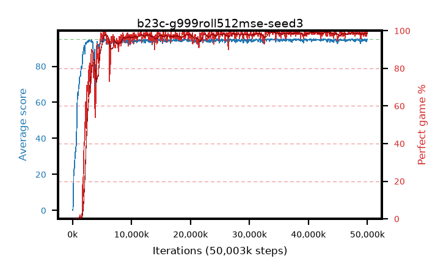

# b23c-g999roll512mse-seed3

step **50,003,968** · 763 evals · trailing **94.44** · peak **94.77** @34,799,616 · sef **93.2** · best30 **99.0** @34,799,616

## Config

| | |
|---|---|
| algo | ppo |
| collect_envs | 128 |
| discount | 0.999 |
| eval_interval | 65536 |
| eval_queue | True |
| eval_queue_depth | 16 |
| eval_workers | 8 |
| fc_layers | (320,) |
| graph_eval_episodes | 100 |
| max_steps | 50003968 |
| min_checkpoint_score | 40.0 |
| ppo_adam_epsilon | 1e-07 |
| ppo_anneal_fraction | 1.0 |
| ppo_clip | 0.2 |
| ppo_clip_final | None |
| ppo_entropy_coef | 0.01 |
| ppo_entropy_coef_final | None |
| ppo_epochs | 4 |
| ppo_gae_lambda | 0.99 |
| ppo_gradient_clipping | 0.5 |
| ppo_horizon | 91.0 |
| ppo_learning_rate | 0.0003 |
| ppo_learning_rate_final | None |
| ppo_minibatch | 256 |
| ppo_normalize_adv | True |
| ppo_rollout | 512 |
| ppo_target_kl | 0.0 |
| ppo_transitions_per_rollout | 65536 |
| ppo_value_loss | mse |
| ppo_vf_coef | 0.5 |
| seed | 3 |
| torch_threads | 1 |

## Evals

| step | avg score | trailing avg | min score | max score | avg reward | perfect % | epsilon |
|---|---|---|---|---|---|---|---|
| 65536 | 0.09 | 0.09 | 0.0 | 3.0 | -4.601 | 0.0 |  |
| 131072 | 4.74 | 2.42 | 0.0 | 12.0 | 1.763 | 0.0 |  |
| 196608 | 19.25 | 8.03 | 4.0 | 34.0 | 14.226 | 0.0 |  |
| ... | ... | ... | ... | ... | ... | ... | ... |
| 49283072 | 94.78 | 94.45 | 73.0 | 95.0 | 192.467 | 99.0 |  |
| 49348608 | 94.31 | 94.42 | 62.0 | 95.0 | 190.047 | 97.0 |  |
| 49414144 | 94.42 | 94.43 | 61.0 | 95.0 | 191.161 | 98.0 |  |
| 49479680 | 95.0 | 94.42 | 95.0 | 95.0 | 193.725 | 100.0 |  |
| 49545216 | 95.0 | 94.44 | 95.0 | 95.0 | 193.732 | 100.0 |  |
| 49610752 | 94.39 | 94.44 | 65.0 | 95.0 | 190.074 | 97.0 |  |
| 49676288 | 93.91 | 94.44 | 2.0 | 95.0 | 190.608 | 98.0 |  |
| 49741824 | 93.96 | 94.41 | 16.0 | 95.0 | 190.694 | 98.0 |  |
| 49807360 | 95.0 | 94.42 | 95.0 | 95.0 | 193.718 | 100.0 |  |
| 49872896 | 93.55 | 94.38 | 6.0 | 95.0 | 189.289 | 97.0 |  |
| 49938432 | 94.7 | 94.41 | 65.0 | 95.0 | 192.437 | 99.0 |  |
| 50003968 | 94.93 | 94.44 | 88.0 | 95.0 | 192.657 | 99.0 |  |
