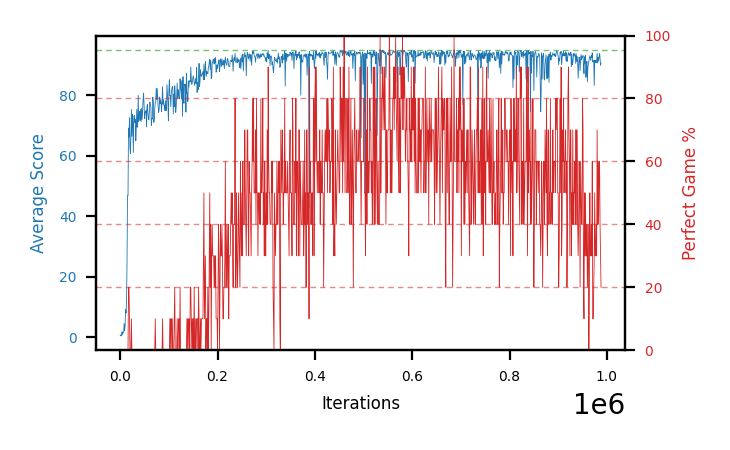

# b23d-beta01seed4

Blue is average score (food eaten) on the left axis, red is perfect-game percentage on the right.

Latest eval: step 988000, avg score 90.6, perfect games 20%.

## Config

| setting | value |
|---|---|
| policy_name | b23d-beta01seed4 |
| seed | 4 |
| zeroed_observations | none |
| learning_rate | 1e-05 |
| batch_size | 128 |
| discount | 0.9975 |
| target_update_period | 1000 |
| target_update_tau | 1.0 |
| gradient_clipping | none |
| n_step_update | 1 |
| initial_epsilon | 0.4 |
| min_epsilon | 0.002 |
| epsilon_schedule | bootstrap on avg_reward [2, 5, 10, 15, 20] then geometric to floor by 80% trailing-30 perfect |
| guided_fraction | 0.8 |
| forking | up to 4 live branches including the main line, fork p=0.5 at length >= 85, branch capped at 60 steps, one branch advanced per iteration |
| exploration_shield | 80% of refinement-phase episodes draw the epsilon move from non-fatal actions; greedy moves never shielded |
| fc_layer_params | (50, 100, 50) |
| replay_buffer | cpprb prioritized, capacity 100000 |
| priority_exponent (alpha) | 0.6 |
| priority_signal | td_error |
| importance_sampling_beta | 0.0 -> 0.1 over 300000 steps |
| max_steps | 3000000 |
| initial_populate_steps | 1000 |
| eval | 10 episodes every 1000 steps |
| grid | 9x9, max possible score 95 |
| DEATH_REWARD | -5.0 |
| FOOD_REWARD | 1.0 |
| FOOD_DISTANCE_REWARD | 0.0 |
| eval_only | False |
| min_checkpoint_score | 40.0 |

## Evals

989 evals so far. Full series in [`b23d-beta01seed4_evals.json`](b23d-beta01seed4_evals.json).

| step | avg score | trailing avg | min score | max score | avg reward | perfect % | epsilon |
|---|---|---|---|---|---|---|---|
| 0 | 0.5 | 0.5 | 0 | 1/95 | -4.5 | 0 | 0.4 |
| 1000 | 0.7 | 0.7 | 0 | 3/95 | 0.2 | 0 | 0.4 |
| 2000 | 0.4 | 0.55 | 0 | 2/95 | -0.1 | 0 | 0.4 |
| ... | | | | | | | |
| 977000 | 91.6 | 89.66 | 74 | 95/95 | 120.05 | 30 | 0.0057 |
| 978000 | 90.7 | 89.58 | 77 | 95/95 | 130.0 | 40 | 0.0057 |
| 979000 | 91.0 | 91.14 | 74 | 95/95 | 120.35 | 30 | 0.0058 |
| 980000 | 93.9 | 91.6 | 89 | 95/95 | 163.05 | 70 | 0.0058 |
| 981000 | 90.7 | 91.58 | 75 | 95/95 | 130.0 | 40 | 0.006 |
| 982000 | 92.5 | 91.76 | 84 | 95/95 | 151.7 | 60 | 0.0058 |
| 983000 | 91.3 | 91.88 | 80 | 95/95 | 130.6 | 40 | 0.0056 |
| 984000 | 92.7 | 92.22 | 78 | 95/95 | 151.9 | 60 | 0.0056 |
| 985000 | 93.8 | 92.2 | 91 | 95/95 | 153.0 | 60 | 0.0055 |
| 986000 | 92.2 | 92.5 | 78 | 95/95 | 131.5 | 40 | 0.0055 |
| 987000 | 89.9 | 91.98 | 82 | 95/95 | 119.25 | 30 | 0.0055 |
| 988000 | 90.6 | 91.84 | 84 | 95/95 | 110.0 | 20 | 0.0056 |
