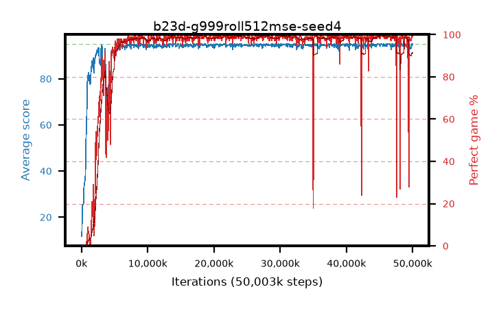

# b23d-g999roll512mse-seed4

step **50,003,968** · 763 evals · trailing **94.43** · peak **94.8** @46,530,560 · sef **91.6** · best30 **99.2** @46,530,560

## Config

| | |
|---|---|
| algo | ppo |
| collect_envs | 128 |
| discount | 0.999 |
| eval_interval | 65536 |
| eval_queue | True |
| eval_queue_depth | 16 |
| eval_workers | 8 |
| fc_layers | (320,) |
| graph_eval_episodes | 100 |
| max_steps | 50003968 |
| min_checkpoint_score | 40.0 |
| ppo_adam_epsilon | 1e-07 |
| ppo_anneal_fraction | 1.0 |
| ppo_clip | 0.2 |
| ppo_clip_final | None |
| ppo_entropy_coef | 0.01 |
| ppo_entropy_coef_final | None |
| ppo_epochs | 4 |
| ppo_gae_lambda | 0.99 |
| ppo_gradient_clipping | 0.5 |
| ppo_horizon | 91.0 |
| ppo_learning_rate | 0.0003 |
| ppo_learning_rate_final | None |
| ppo_minibatch | 256 |
| ppo_normalize_adv | True |
| ppo_rollout | 512 |
| ppo_target_kl | 0.0 |
| ppo_transitions_per_rollout | 65536 |
| ppo_value_loss | mse |
| ppo_vf_coef | 0.5 |
| seed | 4 |
| torch_threads | 1 |

## Evals

| step | avg score | trailing avg | min score | max score | avg reward | perfect % | epsilon |
|---|---|---|---|---|---|---|---|
| 65536 | 11.7 | 11.7 | 1.0 | 25.0 | 6.685 | 0.0 |  |
| 131072 | 25.14 | 18.42 | 5.0 | 50.0 | 20.103 | 0.0 |  |
| 196608 | 25.33 | 20.72 | 6.0 | 50.0 | 20.307 | 0.0 |  |
| ... | ... | ... | ... | ... | ... | ... | ... |
| 49283072 | 93.7 | 94.58 | 30.0 | 95.0 | 189.401 | 97.0 |  |
| 49348608 | 94.75 | 94.6 | 70.0 | 95.0 | 192.475 | 99.0 |  |
| 49414144 | 94.28 | 94.58 | 94.0 | 95.0 | 118.134 | 28.0 |  |
| 49479680 | 94.97 | 94.59 | 92.0 | 95.0 | 192.703 | 99.0 |  |
| 49545216 | 94.27 | 94.58 | 58.0 | 95.0 | 191.01 | 98.0 |  |
| 49610752 | 93.48 | 94.53 | 12.0 | 95.0 | 190.218 | 98.0 |  |
| 49676288 | 92.99 | 94.46 | 12.0 | 95.0 | 188.747 | 97.0 |  |
| 49741824 | 93.46 | 94.46 | 16.0 | 95.0 | 189.212 | 97.0 |  |
| 49807360 | 93.73 | 94.42 | 8.0 | 95.0 | 190.474 | 98.0 |  |
| 49872896 | 95.0 | 94.48 | 95.0 | 95.0 | 193.734 | 100.0 |  |
| 49938432 | 94.59 | 94.51 | 54.0 | 95.0 | 192.331 | 99.0 |  |
| 50003968 | 95.0 | 94.43 | 95.0 | 95.0 | 193.734 | 100.0 |  |
