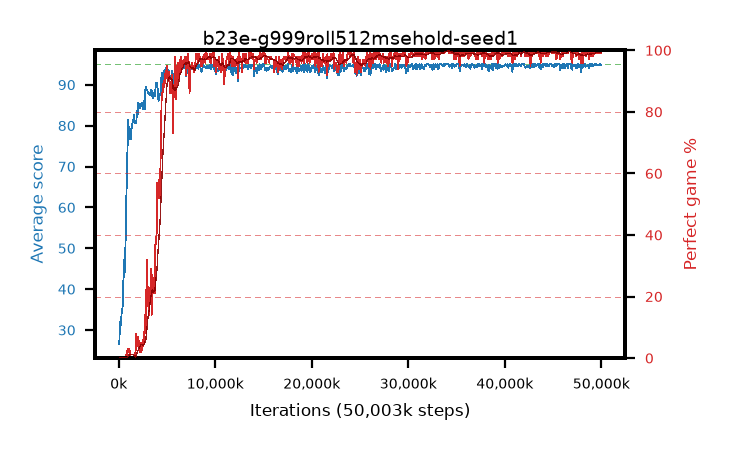

# b23e-g999roll512msehold-seed1

step **50,003,968** · 763 evals · trailing **94.81** · peak **94.85** @35,127,296 · sef **91.1** · best30 **99.3** @34,668,544

## Config

| | |
|---|---|
| algo | ppo |
| collect_envs | 128 |
| discount | 0.999 |
| eval_interval | 65536 |
| eval_queue | True |
| eval_queue_depth | 16 |
| eval_workers | 8 |
| fc_layers | (320,) |
| graph_eval_episodes | 100 |
| max_steps | 50003968 |
| min_checkpoint_score | 40.0 |
| ppo_adam_epsilon | 1e-07 |
| ppo_anneal_fraction | 0.8 |
| ppo_clip | 0.2 |
| ppo_clip_final | 0.001 |
| ppo_entropy_coef | 0.01 |
| ppo_entropy_coef_final | None |
| ppo_epochs | 4 |
| ppo_gae_lambda | 0.99 |
| ppo_gradient_clipping | 0.5 |
| ppo_horizon | 91.0 |
| ppo_learning_rate | 0.0003 |
| ppo_learning_rate_final | None |
| ppo_minibatch | 256 |
| ppo_normalize_adv | True |
| ppo_rollout | 512 |
| ppo_target_kl | 0.0 |
| ppo_transitions_per_rollout | 65536 |
| ppo_value_loss | mse |
| ppo_vf_coef | 0.5 |
| seed | 1 |
| torch_threads | 1 |

## Evals

| step | avg score | trailing avg | min score | max score | avg reward | perfect % | epsilon |
|---|---|---|---|---|---|---|---|
| 65536 | 26.56 | 26.56 | 4.0 | 44.0 | 21.523 | 0.0 |  |
| 131072 | 31.98 | 29.89 | 9.0 | 56.0 | 27.089 | 0.0 |  |
| 196608 | 31.14 | 28.85 | 11.0 | 52.0 | 26.085 | 0.0 |  |
| ... | ... | ... | ... | ... | ... | ... | ... |
| 49283072 | 95.0 | 94.64 | 95.0 | 95.0 | 193.726 | 100.0 |  |
| 49348608 | 94.89 | 94.67 | 84.0 | 95.0 | 192.599 | 99.0 |  |
| 49414144 | 95.0 | 94.7 | 95.0 | 95.0 | 193.723 | 100.0 |  |
| 49479680 | 95.0 | 94.69 | 95.0 | 95.0 | 193.714 | 100.0 |  |
| 49545216 | 94.7 | 94.69 | 65.0 | 95.0 | 192.427 | 99.0 |  |
| 49610752 | 94.97 | 94.69 | 92.0 | 95.0 | 192.694 | 99.0 |  |
| 49676288 | 94.96 | 94.72 | 91.0 | 95.0 | 192.69 | 99.0 |  |
| 49741824 | 94.74 | 94.72 | 69.0 | 95.0 | 192.466 | 99.0 |  |
| 49807360 | 95.0 | 94.73 | 95.0 | 95.0 | 193.709 | 100.0 |  |
| 49872896 | 94.92 | 94.79 | 87.0 | 95.0 | 192.636 | 99.0 |  |
| 49938432 | 95.0 | 94.79 | 95.0 | 95.0 | 193.724 | 100.0 |  |
| 50003968 | 94.75 | 94.81 | 70.0 | 95.0 | 192.466 | 99.0 |  |
