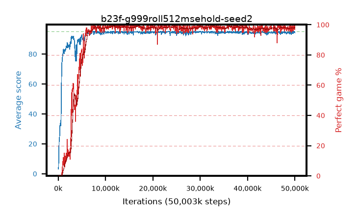

# b23f-g999roll512msehold-seed2

step **50,003,968** · 763 evals · trailing **94.28** · peak **94.71** @30,408,704 · sef **90.0** · best30 **98.8** @12,517,376

## Config

| | |
|---|---|
| algo | ppo |
| collect_envs | 128 |
| discount | 0.999 |
| eval_interval | 65536 |
| eval_queue | True |
| eval_queue_depth | 16 |
| eval_workers | 8 |
| fc_layers | (320,) |
| graph_eval_episodes | 100 |
| max_steps | 50003968 |
| min_checkpoint_score | 40.0 |
| ppo_adam_epsilon | 1e-07 |
| ppo_anneal_fraction | 0.8 |
| ppo_clip | 0.2 |
| ppo_clip_final | 0.001 |
| ppo_entropy_coef | 0.01 |
| ppo_entropy_coef_final | None |
| ppo_epochs | 4 |
| ppo_gae_lambda | 0.99 |
| ppo_gradient_clipping | 0.5 |
| ppo_horizon | 91.0 |
| ppo_learning_rate | 0.0003 |
| ppo_learning_rate_final | None |
| ppo_minibatch | 256 |
| ppo_normalize_adv | True |
| ppo_rollout | 512 |
| ppo_target_kl | 0.0 |
| ppo_transitions_per_rollout | 65536 |
| ppo_value_loss | mse |
| ppo_vf_coef | 0.5 |
| seed | 2 |
| torch_threads | 1 |

## Evals

| step | avg score | trailing avg | min score | max score | avg reward | perfect % | epsilon |
|---|---|---|---|---|---|---|---|
| 65536 | 3.18 | 3.18 | 0.0 | 10.0 | -0.292 | 0.0 |  |
| 131072 | 12.61 | 7.89 | 2.0 | 25.0 | 7.948 | 0.0 |  |
| 196608 | 21.34 | 12.38 | 4.0 | 41.0 | 16.314 | 0.0 |  |
| ... | ... | ... | ... | ... | ... | ... | ... |
| 49283072 | 92.93 | 94.31 | 24.0 | 95.0 | 186.683 | 95.0 |  |
| 49348608 | 94.92 | 94.35 | 87.0 | 95.0 | 192.653 | 99.0 |  |
| 49414144 | 93.76 | 94.32 | 54.0 | 95.0 | 188.497 | 96.0 |  |
| 49479680 | 95.0 | 94.32 | 95.0 | 95.0 | 193.74 | 100.0 |  |
| 49545216 | 93.82 | 94.29 | 12.0 | 95.0 | 190.562 | 98.0 |  |
| 49610752 | 94.72 | 94.31 | 72.0 | 95.0 | 191.462 | 98.0 |  |
| 49676288 | 93.63 | 94.27 | 57.0 | 95.0 | 188.376 | 96.0 |  |
| 49741824 | 95.0 | 94.3 | 95.0 | 95.0 | 193.73 | 100.0 |  |
| 49807360 | 94.32 | 94.28 | 70.0 | 95.0 | 190.062 | 97.0 |  |
| 49872896 | 95.0 | 94.3 | 95.0 | 95.0 | 193.735 | 100.0 |  |
| 49938432 | 94.71 | 94.27 | 66.0 | 95.0 | 192.439 | 99.0 |  |
| 50003968 | 94.23 | 94.28 | 59.0 | 95.0 | 189.97 | 97.0 |  |
