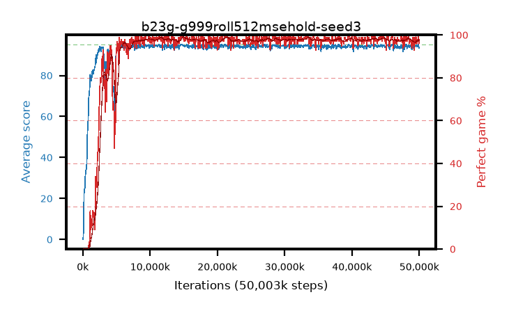

# b23g-g999roll512msehold-seed3

step **50,003,968** · 763 evals · trailing **94.11** · peak **94.52** @11,534,336 · sef **93.1** · best30 **98.4** @44,826,624

## Config

| | |
|---|---|
| algo | ppo |
| collect_envs | 128 |
| discount | 0.999 |
| eval_interval | 65536 |
| eval_queue | True |
| eval_queue_depth | 16 |
| eval_workers | 8 |
| fc_layers | (320,) |
| graph_eval_episodes | 100 |
| max_steps | 50003968 |
| min_checkpoint_score | 40.0 |
| ppo_adam_epsilon | 1e-07 |
| ppo_anneal_fraction | 0.8 |
| ppo_clip | 0.2 |
| ppo_clip_final | 0.001 |
| ppo_entropy_coef | 0.01 |
| ppo_entropy_coef_final | None |
| ppo_epochs | 4 |
| ppo_gae_lambda | 0.99 |
| ppo_gradient_clipping | 0.5 |
| ppo_horizon | 91.0 |
| ppo_learning_rate | 0.0003 |
| ppo_learning_rate_final | None |
| ppo_minibatch | 256 |
| ppo_normalize_adv | True |
| ppo_rollout | 512 |
| ppo_target_kl | 0.0 |
| ppo_transitions_per_rollout | 65536 |
| ppo_value_loss | mse |
| ppo_vf_coef | 0.5 |
| seed | 3 |
| torch_threads | 1 |

## Evals

| step | avg score | trailing avg | min score | max score | avg reward | perfect % | epsilon |
|---|---|---|---|---|---|---|---|
| 65536 | 0.05 | 0.05 | 0.0 | 1.0 | -4.284 | 0.0 |  |
| 131072 | 6.78 | 3.42 | 1.0 | 14.0 | 3.016 | 0.0 |  |
| 196608 | 22.72 | 9.85 | 8.0 | 36.0 | 17.682 | 0.0 |  |
| ... | ... | ... | ... | ... | ... | ... | ... |
| 49283072 | 94.72 | 94.1 | 67.0 | 95.0 | 192.45 | 99.0 |  |
| 49348608 | 93.99 | 94.06 | 56.0 | 95.0 | 189.733 | 97.0 |  |
| 49414144 | 94.45 | 94.15 | 57.0 | 95.0 | 189.185 | 96.0 |  |
| 49479680 | 94.65 | 94.14 | 60.0 | 95.0 | 192.385 | 99.0 |  |
| 49545216 | 94.72 | 94.04 | 67.0 | 95.0 | 192.464 | 99.0 |  |
| 49610752 | 94.04 | 94.05 | 61.0 | 95.0 | 188.739 | 96.0 |  |
| 49676288 | 93.94 | 94.12 | 58.0 | 95.0 | 189.683 | 97.0 |  |
| 49741824 | 94.31 | 94.14 | 61.0 | 95.0 | 190.0 | 97.0 |  |
| 49807360 | 94.76 | 94.14 | 74.0 | 95.0 | 191.494 | 98.0 |  |
| 49872896 | 95.0 | 94.11 | 95.0 | 95.0 | 193.734 | 100.0 |  |
| 49938432 | 93.28 | 94.14 | 6.0 | 95.0 | 188.032 | 96.0 |  |
| 50003968 | 93.9 | 94.11 | 18.0 | 95.0 | 190.642 | 98.0 |  |
