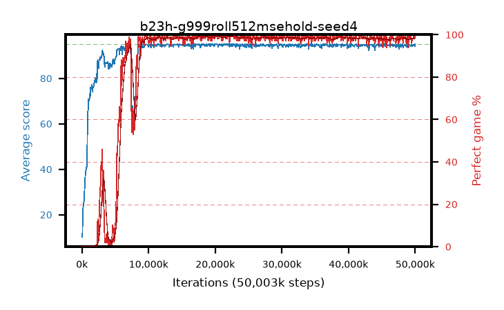

# b23h-g999roll512msehold-seed4

step **50,003,968** · 763 evals · trailing **94.45** · peak **94.8** @21,954,560 · sef **86.9** · best30 **99.3** @23,134,208

## Config

| | |
|---|---|
| algo | ppo |
| collect_envs | 128 |
| discount | 0.999 |
| eval_interval | 65536 |
| eval_queue | True |
| eval_queue_depth | 16 |
| eval_workers | 8 |
| fc_layers | (320,) |
| graph_eval_episodes | 100 |
| max_steps | 50003968 |
| min_checkpoint_score | 40.0 |
| ppo_adam_epsilon | 1e-07 |
| ppo_anneal_fraction | 0.8 |
| ppo_clip | 0.2 |
| ppo_clip_final | 0.001 |
| ppo_entropy_coef | 0.01 |
| ppo_entropy_coef_final | None |
| ppo_epochs | 4 |
| ppo_gae_lambda | 0.99 |
| ppo_gradient_clipping | 0.5 |
| ppo_horizon | 91.0 |
| ppo_learning_rate | 0.0003 |
| ppo_learning_rate_final | None |
| ppo_minibatch | 256 |
| ppo_normalize_adv | True |
| ppo_rollout | 512 |
| ppo_target_kl | 0.0 |
| ppo_transitions_per_rollout | 65536 |
| ppo_value_loss | mse |
| ppo_vf_coef | 0.5 |
| seed | 4 |
| torch_threads | 1 |

## Evals

| step | avg score | trailing avg | min score | max score | avg reward | perfect % | epsilon |
|---|---|---|---|---|---|---|---|
| 65536 | 10.16 | 10.16 | 0.0 | 21.0 | 5.147 | 0.0 |  |
| 131072 | 21.16 | 15.66 | 4.0 | 42.0 | 16.134 | 0.0 |  |
| 196608 | 23.84 | 18.39 | 8.0 | 41.0 | 18.824 | 0.0 |  |
| ... | ... | ... | ... | ... | ... | ... | ... |
| 49283072 | 94.66 | 94.4 | 61.0 | 95.0 | 192.385 | 99.0 |  |
| 49348608 | 94.23 | 94.37 | 18.0 | 95.0 | 191.968 | 99.0 |  |
| 49414144 | 94.95 | 94.39 | 92.0 | 95.0 | 191.693 | 98.0 |  |
| 49479680 | 94.08 | 94.4 | 67.0 | 95.0 | 188.824 | 96.0 |  |
| 49545216 | 94.36 | 94.44 | 57.0 | 95.0 | 191.096 | 98.0 |  |
| 49610752 | 94.46 | 94.43 | 64.0 | 95.0 | 191.19 | 98.0 |  |
| 49676288 | 94.4 | 94.44 | 64.0 | 95.0 | 191.132 | 98.0 |  |
| 49741824 | 94.65 | 94.45 | 60.0 | 95.0 | 192.385 | 99.0 |  |
| 49807360 | 94.8 | 94.45 | 75.0 | 95.0 | 192.535 | 99.0 |  |
| 49872896 | 94.32 | 94.46 | 59.0 | 95.0 | 191.062 | 98.0 |  |
| 49938432 | 94.23 | 94.45 | 18.0 | 95.0 | 191.981 | 99.0 |  |
| 50003968 | 95.0 | 94.45 | 95.0 | 95.0 | 193.725 | 100.0 |  |
