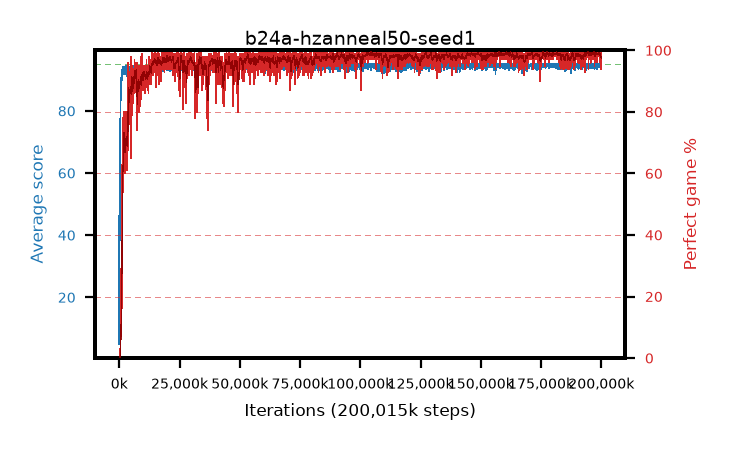

# b24a-hzanneal50-seed1

step **200,015,872** · 6104 evals · trailing **94.61** · peak **94.84** @171,376,640 · sef **98.0** · best30 **99.3** @194,510,848

## Config

| | |
|---|---|
| algo | ppo |
| collect_envs | 128 |
| discount | 0.99 |
| eval_interval | 32768 |
| eval_queue | True |
| eval_queue_depth | 16 |
| eval_workers | 8 |
| fc_layers | (320,) |
| graph_eval_episodes | 100 |
| max_steps | 200015872 |
| min_checkpoint_score | 40.0 |
| ppo_adam_epsilon | 1e-07 |
| ppo_anneal_fraction | 0.5 |
| ppo_clip | 0.2 |
| ppo_clip_final | None |
| ppo_discount_final | 0.999 |
| ppo_entropy_coef | 0.01 |
| ppo_entropy_coef_final | 0.001 |
| ppo_epochs | 4 |
| ppo_gae_lambda | 0.95 |
| ppo_gae_lambda_final | 0.999 |
| ppo_gradient_clipping | 0.5 |
| ppo_horizon | 16.8 |
| ppo_horizon_final | 500.3 |
| ppo_learning_rate | 0.00025 |
| ppo_learning_rate_final | None |
| ppo_minibatch | 512 |
| ppo_normalize_adv | True |
| ppo_rollout | 256 |
| ppo_target_kl | 0.0 |
| ppo_transitions_per_rollout | 32768 |
| ppo_value_loss | huber |
| ppo_vf_coef | 0.5 |
| seed | 1 |
| torch_threads | 1 |

## Evals

| step | avg score | trailing avg | min score | max score | avg reward | perfect % | epsilon |
|---|---|---|---|---|---|---|---|
| 32768 | 4.94 | 4.94 | 0.0 | 21.0 | 4.345 | 0.0 |  |
| 65536 | 46.46 | 34.02 | 23.0 | 75.0 | 41.357 | 0.0 |  |
| 98304 | 45.23 | 35.89 | 13.0 | 84.0 | 40.322 | 0.0 |  |
| ... | ... | ... | ... | ... | ... | ... | ... |
| 199655424 | 94.77 | 94.68 | 84.0 | 95.0 | 190.51 | 97.0 |  |
| 199688192 | 94.66 | 94.67 | 61.0 | 95.0 | 192.396 | 99.0 |  |
| 199720960 | 95.0 | 94.67 | 95.0 | 95.0 | 193.74 | 100.0 |  |
| 199753728 | 94.61 | 94.6 | 67.0 | 95.0 | 191.329 | 98.0 |  |
| 199786496 | 93.57 | 94.62 | 62.0 | 95.0 | 186.317 | 94.0 |  |
| 199819264 | 93.71 | 94.6 | 24.0 | 95.0 | 188.452 | 96.0 |  |
| 199852032 | 93.95 | 94.64 | 18.0 | 95.0 | 190.702 | 98.0 |  |
| 199884800 | 94.63 | 94.62 | 78.0 | 95.0 | 190.373 | 97.0 |  |
| 199917568 | 94.78 | 94.62 | 85.0 | 95.0 | 190.516 | 97.0 |  |
| 199950336 | 94.72 | 94.61 | 67.0 | 95.0 | 192.458 | 99.0 |  |
| 199983104 | 95.0 | 94.64 | 95.0 | 95.0 | 193.741 | 100.0 |  |
| 200015872 | 94.3 | 94.61 | 58.0 | 95.0 | 191.047 | 98.0 |  |
