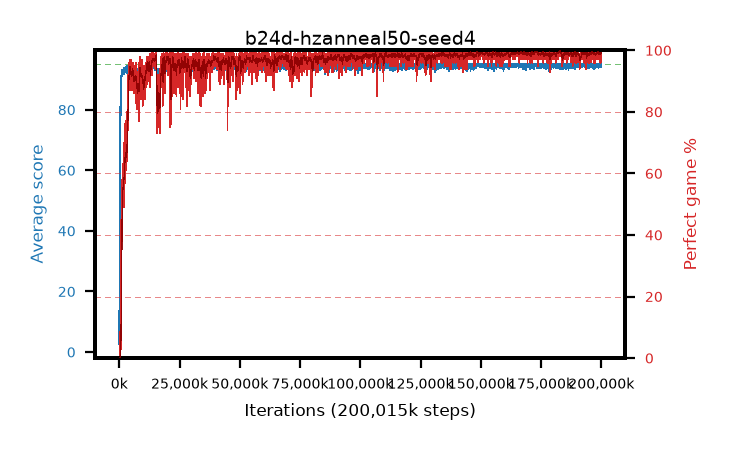

# b24d-hzanneal50-seed4

step **200,015,872** · 6104 evals · trailing **94.8** · peak **94.89** @173,703,168 · sef **98.0** · best30 **99.5** @183,074,816

## Config

| | |
|---|---|
| algo | ppo |
| collect_envs | 128 |
| discount | 0.99 |
| eval_interval | 32768 |
| eval_queue | True |
| eval_queue_depth | 16 |
| eval_workers | 8 |
| fc_layers | (320,) |
| graph_eval_episodes | 100 |
| max_steps | 200015872 |
| min_checkpoint_score | 40.0 |
| ppo_adam_epsilon | 1e-07 |
| ppo_anneal_fraction | 0.5 |
| ppo_clip | 0.2 |
| ppo_clip_final | None |
| ppo_discount_final | 0.999 |
| ppo_entropy_coef | 0.01 |
| ppo_entropy_coef_final | 0.001 |
| ppo_epochs | 4 |
| ppo_gae_lambda | 0.95 |
| ppo_gae_lambda_final | 0.999 |
| ppo_gradient_clipping | 0.5 |
| ppo_horizon | 16.8 |
| ppo_horizon_final | 500.3 |
| ppo_learning_rate | 0.00025 |
| ppo_learning_rate_final | None |
| ppo_minibatch | 512 |
| ppo_normalize_adv | True |
| ppo_rollout | 256 |
| ppo_target_kl | 0.0 |
| ppo_transitions_per_rollout | 32768 |
| ppo_value_loss | huber |
| ppo_vf_coef | 0.5 |
| seed | 4 |
| torch_threads | 1 |

## Evals

| step | avg score | trailing avg | min score | max score | avg reward | perfect % | epsilon |
|---|---|---|---|---|---|---|---|
| 32768 | 2.63 | 2.63 | 0.0 | 8.0 | -0.562 | 0.0 |  |
| 65536 | 18.13 | 10.38 | 0.0 | 37.0 | 14.649 | 0.0 |  |
| 98304 | 28.23 | 16.33 | 8.0 | 48.0 | 23.176 | 0.0 |  |
| ... | ... | ... | ... | ... | ... | ... | ... |
| 199655424 | 95.0 | 94.81 | 95.0 | 95.0 | 193.726 | 100.0 |  |
| 199688192 | 94.79 | 94.78 | 74.0 | 95.0 | 192.528 | 99.0 |  |
| 199720960 | 94.24 | 94.76 | 19.0 | 95.0 | 191.947 | 99.0 |  |
| 199753728 | 94.95 | 94.82 | 90.0 | 95.0 | 192.683 | 99.0 |  |
| 199786496 | 94.91 | 94.84 | 86.0 | 95.0 | 192.647 | 99.0 |  |
| 199819264 | 95.0 | 94.77 | 95.0 | 95.0 | 193.737 | 100.0 |  |
| 199852032 | 94.93 | 94.77 | 88.0 | 95.0 | 192.669 | 99.0 |  |
| 199884800 | 95.0 | 94.85 | 95.0 | 95.0 | 193.737 | 100.0 |  |
| 199917568 | 94.78 | 94.81 | 73.0 | 95.0 | 192.482 | 99.0 |  |
| 199950336 | 95.0 | 94.85 | 95.0 | 95.0 | 193.723 | 100.0 |  |
| 199983104 | 94.51 | 94.83 | 58.0 | 95.0 | 189.247 | 96.0 |  |
| 200015872 | 94.15 | 94.8 | 10.0 | 95.0 | 191.884 | 99.0 |  |
