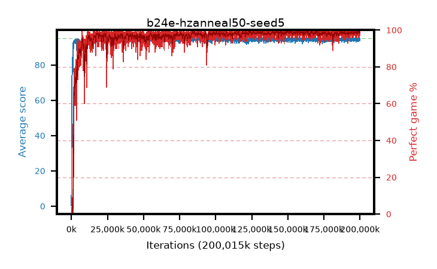

# b24e-hzanneal50-seed5

step **200,015,872** · 6104 evals · trailing **94.64** · peak **94.77** @157,777,920 · sef **97.9** · best30 **99.1** @157,646,848

## Config

| | |
|---|---|
| algo | ppo |
| collect_envs | 128 |
| discount | 0.99 |
| eval_interval | 32768 |
| eval_queue | True |
| eval_queue_depth | 16 |
| eval_workers | 8 |
| fc_layers | (320,) |
| graph_eval_episodes | 100 |
| max_steps | 200015872 |
| min_checkpoint_score | 40.0 |
| ppo_adam_epsilon | 1e-07 |
| ppo_anneal_fraction | 0.5 |
| ppo_clip | 0.2 |
| ppo_clip_final | None |
| ppo_discount_final | 0.999 |
| ppo_entropy_coef | 0.01 |
| ppo_entropy_coef_final | 0.001 |
| ppo_epochs | 4 |
| ppo_gae_lambda | 0.95 |
| ppo_gae_lambda_final | 0.999 |
| ppo_gradient_clipping | 0.5 |
| ppo_horizon | 16.8 |
| ppo_horizon_final | 500.3 |
| ppo_learning_rate | 0.00025 |
| ppo_learning_rate_final | None |
| ppo_minibatch | 512 |
| ppo_normalize_adv | True |
| ppo_rollout | 256 |
| ppo_target_kl | 0.0 |
| ppo_transitions_per_rollout | 32768 |
| ppo_value_loss | huber |
| ppo_vf_coef | 0.5 |
| seed | 5 |
| torch_threads | 1 |

## Evals

| step | avg score | trailing avg | min score | max score | avg reward | perfect % | epsilon |
|---|---|---|---|---|---|---|---|
| 32768 | 0.27 | 0.27 | 0.0 | 2.0 | -4.736 | 0.0 |  |
| 65536 | 3.14 | 1.71 | 0.0 | 11.0 | 0.472 | 0.0 |  |
| 98304 | 22.75 | 8.72 | 10.0 | 41.0 | 17.75 | 0.0 |  |
| ... | ... | ... | ... | ... | ... | ... | ... |
| 199655424 | 95.0 | 94.61 | 95.0 | 95.0 | 193.736 | 100.0 |  |
| 199688192 | 94.66 | 94.61 | 73.0 | 95.0 | 191.349 | 98.0 |  |
| 199720960 | 95.0 | 94.61 | 95.0 | 95.0 | 193.725 | 100.0 |  |
| 199753728 | 94.06 | 94.59 | 14.0 | 95.0 | 189.76 | 97.0 |  |
| 199786496 | 94.13 | 94.58 | 8.0 | 95.0 | 191.873 | 99.0 |  |
| 199819264 | 94.58 | 94.59 | 59.0 | 95.0 | 191.282 | 98.0 |  |
| 199852032 | 93.76 | 94.58 | 8.0 | 95.0 | 190.454 | 98.0 |  |
| 199884800 | 94.63 | 94.6 | 58.0 | 95.0 | 192.366 | 99.0 |  |
| 199917568 | 95.0 | 94.61 | 95.0 | 95.0 | 193.719 | 100.0 |  |
| 199950336 | 95.0 | 94.59 | 95.0 | 95.0 | 193.744 | 100.0 |  |
| 199983104 | 94.7 | 94.61 | 65.0 | 95.0 | 192.441 | 99.0 |  |
| 200015872 | 94.97 | 94.64 | 92.0 | 95.0 | 192.701 | 99.0 |  |
