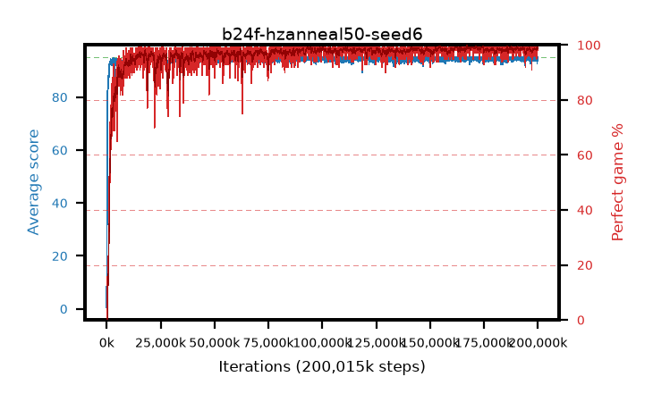

# b24f-hzanneal50-seed6

step **200,015,872** · 6104 evals · trailing **94.56** · peak **94.83** @174,784,512 · sef **98.1** · best30 **99.3** @171,474,944

## Config

| | |
|---|---|
| algo | ppo |
| collect_envs | 128 |
| discount | 0.99 |
| eval_interval | 32768 |
| eval_queue | True |
| eval_queue_depth | 16 |
| eval_workers | 8 |
| fc_layers | (320,) |
| graph_eval_episodes | 100 |
| max_steps | 200015872 |
| min_checkpoint_score | 40.0 |
| ppo_adam_epsilon | 1e-07 |
| ppo_anneal_fraction | 0.5 |
| ppo_clip | 0.2 |
| ppo_clip_final | None |
| ppo_discount_final | 0.999 |
| ppo_entropy_coef | 0.01 |
| ppo_entropy_coef_final | 0.001 |
| ppo_epochs | 4 |
| ppo_gae_lambda | 0.95 |
| ppo_gae_lambda_final | 0.999 |
| ppo_gradient_clipping | 0.5 |
| ppo_horizon | 16.8 |
| ppo_horizon_final | 500.3 |
| ppo_learning_rate | 0.00025 |
| ppo_learning_rate_final | None |
| ppo_minibatch | 512 |
| ppo_normalize_adv | True |
| ppo_rollout | 256 |
| ppo_target_kl | 0.0 |
| ppo_transitions_per_rollout | 32768 |
| ppo_value_loss | huber |
| ppo_vf_coef | 0.5 |
| seed | 6 |
| torch_threads | 1 |

## Evals

| step | avg score | trailing avg | min score | max score | avg reward | perfect % | epsilon |
|---|---|---|---|---|---|---|---|
| 32768 | 0.55 | 0.55 | 0.0 | 3.0 | -0.004 | 0.0 |  |
| 65536 | 2.74 | 1.65 | 0.0 | 11.0 | 2.183 | 0.0 |  |
| 98304 | 32.47 | 19.88 | 10.0 | 80.0 | 27.39 | 0.0 |  |
| ... | ... | ... | ... | ... | ... | ... | ... |
| 199655424 | 95.0 | 94.59 | 95.0 | 95.0 | 193.736 | 100.0 |  |
| 199688192 | 92.55 | 94.55 | 7.0 | 95.0 | 187.302 | 96.0 |  |
| 199720960 | 95.0 | 94.55 | 95.0 | 95.0 | 193.732 | 100.0 |  |
| 199753728 | 94.95 | 94.59 | 90.0 | 95.0 | 192.686 | 99.0 |  |
| 199786496 | 94.67 | 94.55 | 62.0 | 95.0 | 192.413 | 99.0 |  |
| 199819264 | 94.42 | 94.58 | 60.0 | 95.0 | 191.156 | 98.0 |  |
| 199852032 | 93.71 | 94.57 | 3.0 | 95.0 | 190.459 | 98.0 |  |
| 199884800 | 95.0 | 94.55 | 95.0 | 95.0 | 193.736 | 100.0 |  |
| 199917568 | 94.53 | 94.58 | 65.0 | 95.0 | 191.264 | 98.0 |  |
| 199950336 | 94.87 | 94.57 | 82.0 | 95.0 | 192.606 | 99.0 |  |
| 199983104 | 94.13 | 94.55 | 8.0 | 95.0 | 191.853 | 99.0 |  |
| 200015872 | 94.37 | 94.56 | 59.0 | 95.0 | 191.116 | 98.0 |  |
