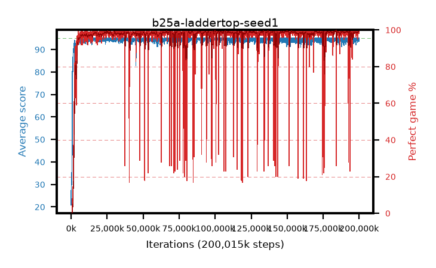

# b25a-laddertop-seed1

step **200,015,872** · 3052 evals · trailing **94.58** · peak **94.79** @99,811,328 · sef **96.6** · best30 **99.5** @184,090,624

## Config

| | |
|---|---|
| algo | ppo |
| collect_envs | 128 |
| discount | 0.999 |
| eval_interval | 65536 |
| eval_queue | True |
| eval_queue_depth | 16 |
| eval_workers | 8 |
| fc_layers | (320,) |
| graph_eval_episodes | 100 |
| max_steps | 200015872 |
| min_checkpoint_score | 40.0 |
| ppo_adam_epsilon | 1e-07 |
| ppo_anneal_fraction | 0.8 |
| ppo_clip | 0.2 |
| ppo_clip_final | 0.001 |
| ppo_discount_final | None |
| ppo_entropy_coef | 0.01 |
| ppo_entropy_coef_final | None |
| ppo_epochs | 4 |
| ppo_gae_lambda | 0.99 |
| ppo_gae_lambda_final | None |
| ppo_gradient_clipping | 0.5 |
| ppo_horizon | 91.0 |
| ppo_learning_rate | 0.0003 |
| ppo_learning_rate_final | None |
| ppo_minibatch | 256 |
| ppo_normalize_adv | True |
| ppo_rollout | 512 |
| ppo_target_kl | 0.0 |
| ppo_transitions_per_rollout | 65536 |
| ppo_value_loss | mse |
| ppo_vf_coef | 0.5 |
| seed | 1 |
| torch_threads | 1 |

## Evals

| step | avg score | trailing avg | min score | max score | avg reward | perfect % | epsilon |
|---|---|---|---|---|---|---|---|
| 65536 | 20.89 | 20.89 | 1.0 | 44.0 | 16.935 | 0.0 |  |
| 131072 | 31.86 | 26.38 | 11.0 | 59.0 | 26.875 | 0.0 |  |
| 196608 | 31.44 | 28.06 | 8.0 | 57.0 | 26.39 | 0.0 |  |
| ... | ... | ... | ... | ... | ... | ... | ... |
| 199294976 | 94.09 | 94.46 | 5.0 | 95.0 | 190.788 | 98.0 |  |
| 199360512 | 95.0 | 94.49 | 95.0 | 95.0 | 193.743 | 100.0 |  |
| 199426048 | 95.0 | 94.52 | 95.0 | 95.0 | 193.73 | 100.0 |  |
| 199491584 | 94.18 | 94.52 | 13.0 | 95.0 | 191.929 | 99.0 |  |
| 199557120 | 94.02 | 94.49 | 5.0 | 95.0 | 190.723 | 98.0 |  |
| 199622656 | 95.0 | 94.52 | 95.0 | 95.0 | 193.743 | 100.0 |  |
| 199688192 | 95.0 | 94.49 | 95.0 | 95.0 | 193.733 | 100.0 |  |
| 199753728 | 94.24 | 94.56 | 19.0 | 95.0 | 191.978 | 99.0 |  |
| 199819264 | 95.0 | 94.56 | 95.0 | 95.0 | 193.747 | 100.0 |  |
| 199884800 | 94.38 | 94.58 | 33.0 | 95.0 | 192.12 | 99.0 |  |
| 199950336 | 95.0 | 94.59 | 95.0 | 95.0 | 193.739 | 100.0 |  |
| 200015872 | 93.81 | 94.58 | 7.0 | 95.0 | 190.559 | 98.0 |  |
